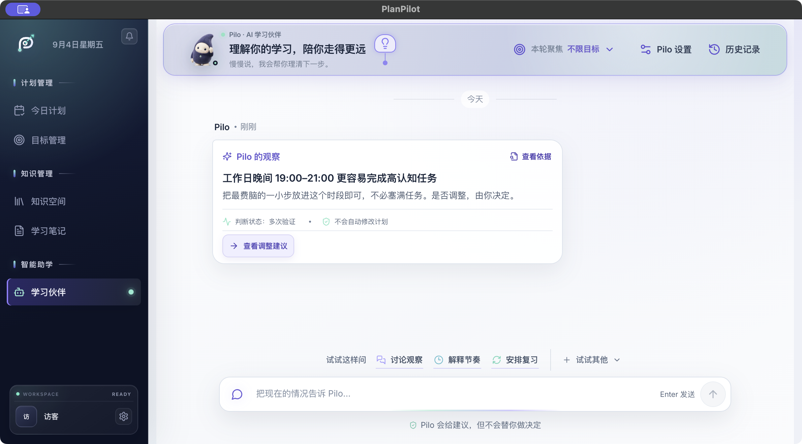

# PlanPilot｜AI 学习执行与陪伴产品

[产品官网](https://planpilot-website.planpilot-wxyra.workers.dev/) · 本仓库提供桌面端完整产品走查

> 一款面向在职备考者和职业转型学习者的桌面学习工具，把长期目标拆成今天能完成的行动，并在计划被工作或生活打断后，帮助用户低成本恢复节奏。

- **项目阶段：** 个人 0→1 可运行 MVP，当前处于产品假设与核心链路验证阶段。
- **我的职责：** 产品定位、场景拆解、竞品分析、信息架构、PRD、交互设计、验收口径与 MVP 落地。

## 为什么做这个产品

我先把场景收窄到一类有明确截止日期、可用时间经常变化的成年学习者：在职备考者，以及需要完成作品集的职业转型者。

他们通常已经拥有课程、笔记、日历和 AI 工具，真正费力的是把这些工具拼成一条持续数周的执行路径：

- 计划写得很完整，今天仍然不知道先做哪一步；
- 加班或临时中断后，逾期任务不断堆积，重新排计划的成本很高；
- 勾选“完成”很容易，用户仍无法判断自己是否掌握；
- AI 给出的建议缺少来源和影响说明，用户不敢让它直接改计划。

因此，PlanPilot 的产品主线被定义为：

> **目标 → 今日行动 → 实际投入 → 学习证据 → 偏差恢复 → 下一轮计划**

## MVP 希望验证什么

本阶段关注三个问题：用户能否更快开始、被打断后能否回来、完成后能否留下可检查的掌握证据。

计划在真实测试中观察：

| 验证问题 | 指标口径 |
| --- | --- |
| 首次价值是否足够快 | 10 分钟目标建立率、24 小时首次行动率 |
| 恢复机制是否降低放弃 | 偏差发生后 72 小时恢复率 |
| 完成是否形成学习价值 | 关键任务证据率、7 日后同类任务表现 |
| AI 行动是否可信 | 未确认写入、错误回读、撤销失败均为 0 |

这些是下一阶段的验证指标，当前没有真实留存、成绩提升或收入数据。

## 核心方案与产品判断

### 1. 今日计划：先帮助用户开始

首页首屏直接呈现今日任务、优先级、预计时长和实际投入。用户进入工作区后先看到下一步，AI 对话保留为辅助入口。

示例中包含 3 个任务：Python 核心练习、英语精读和晨间写作。完成状态与实际投入分开记录，避免把一次勾选当成学习效果。

### 2. 目标管理：把长期压力换算成近期节奏

目标总览同时展示进度、剩余天数、风险和下一项行动。用户可以先处理节奏落后的目标，再进入单目标查看时间是否够用。

单目标页把任务量换算为每日负荷。示例目标剩余 12 天，未来一周安排 7 个任务，系统计算每天需要 29 分钟，占用 48% 的可投入时间。用户能据此判断计划是否现实。

### 3. 知识空间：让资料进入行动上下文

学习资料按目标关联，并显示解析、索引和 AI 可引用状态。这个设计解决两个问题：用户知道系统实际读到了什么；后续计划、解释和验收可以追溯到具体资料。

## 为什么设计 Pilo

独立聊天页会给用户增加一道“先去找 AI、再重新解释背景”的操作。Pilo 因此采用轻量常驻的陪伴形态：默认安静，不遮挡主任务；用户需要帮助时，它会带入当前页面、目标、任务或资料上下文。

这个入口刻意降低了“AI 助手”的工具感。陪伴感来自持续理解当前进度、记住用户允许保留的偏好，以及在合适的场景给出下一步；真正涉及数据修改时，仍然由用户做决定。

| 所在页面 | Pilo 承担的职责 |
| --- | --- |
| 今日计划 | 解释当前任务、回看实际投入、讨论改期和当天复盘 |
| 目标管理 | 分析进度、学习债务与时间容量，提出恢复方案 |
| 知识空间 | 围绕当前资料和目标回答，说明引用来源与处理状态 |
| 学习笔记 | 帮助整理理解、关联任务，并把讨论带回下一项行动 |
| 学习伙伴 | 跨目标观察学习节奏，讨论建议，并发起受监督行动 |

### 建议有依据，行动有确认

Pilo 的观察可以展开查看证据范围。示例建议来自 21 条近期记录，并区分“多次验证”和“仍需观察”的判断状态。

当建议会改变计划时，系统先展示影响。示例方案预计释放 95 分钟，用户可以接受，也可以保持现状；确认前不会写入任务。

## 当前验证结果

- 已跑通“目标建立—任务执行—实际投入—资料证据—Pilo 观察—调整预览—用户确认”的桌面端链路；
- 合成场景包含 6 个长期目标、3 个今日任务、7 天连续计划和 21 条建议依据，可稳定复现关键状态；
- 最近一次目标—计划闭环验收记录为后端定向测试 52 项通过、桌面端测试 14 项通过；
- 当前结果证明产品流程可演示、关键状态可回读，还不能代表真实学习效果。

## 我的关键决策与复盘

1. **把“今日计划”设为主价值面。** 用户先做事，Pilo 在需要解释、权衡或恢复时出现。
2. **把中断当成正常状态。** 产品提供保底、标准和冲刺三种恢复思路，减少逾期带来的挫败感。
3. **拆开完成与掌握。** 任务完成记录行为，解释、应用和作品记录学习证据。
4. **限制 AI 的写入权。** 所有调整先展示依据和影响，再由用户确认，执行后还要回读结果。
5. **收缩近期信息量。** 长期目标保留里程碑，页面优先呈现今天和未来一周，降低维护负担。

本轮最大的迭代，是把分散的 AI 能力收拢到一条学习执行主线，并让 Pilo 随场景提供帮助。下一步将先做真实事件访谈和可用性走查，再决定是否扩大功能范围。

## 数据说明

截图中的用户、目标、任务、学习记录和指标均为合成演示数据。当前没有真实用户研究结果、生产留存或商业收入，README 中已将产品目标、模拟验证和真实结果分开表达。
