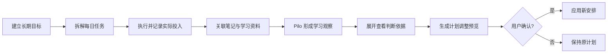
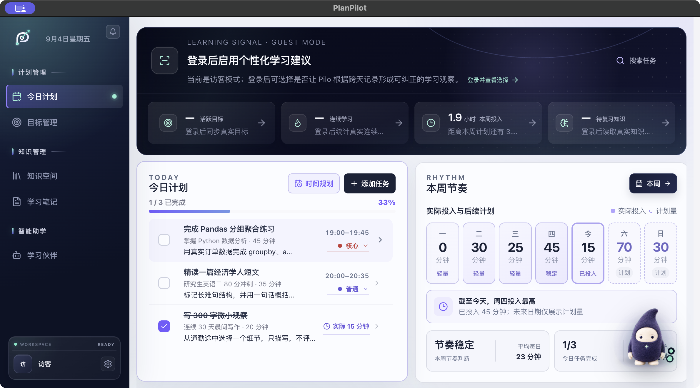
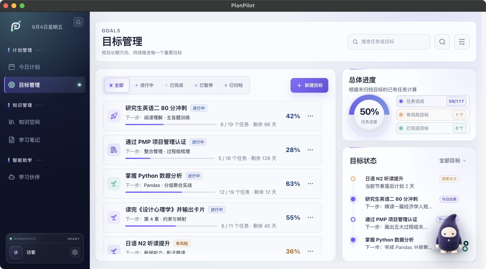
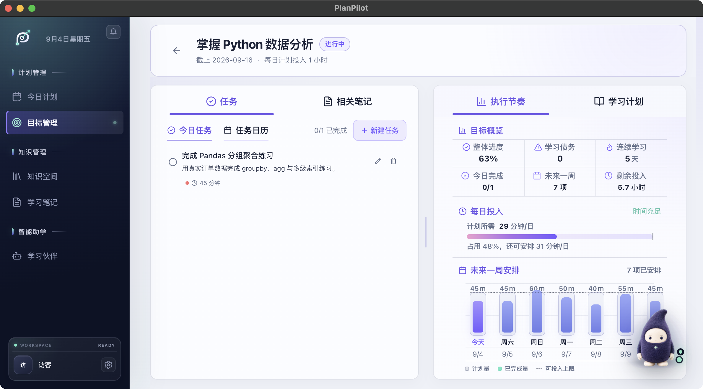
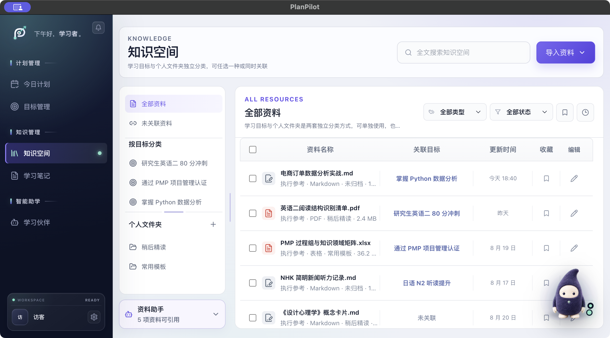
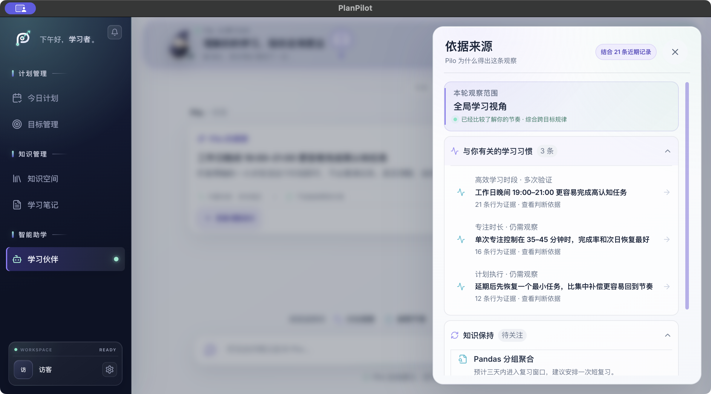
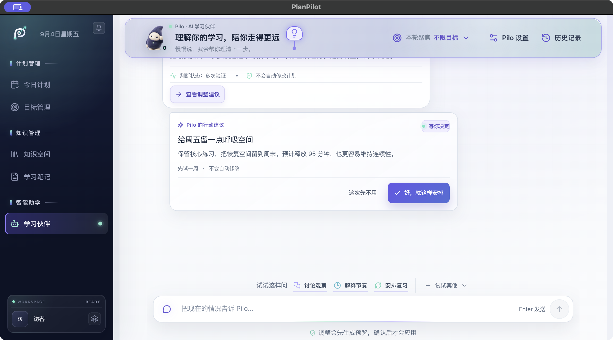
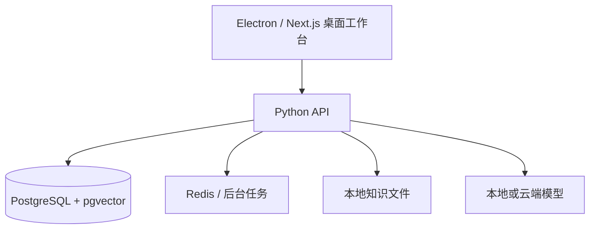

# PlanPilot

> AI 学习规划与执行工作台 · AI Learning Planning & Execution Workspace

[🌐 访问 PlanPilot 产品官网](https://planpilot-website.planpilot-wxyra.workers.dev/)

PlanPilot 不是一个普通待办工具。它把长期目标、每日任务、学习资料、实际投入、复盘证据和 AI 建议连接成一条可解释、可确认的执行闭环。

本仓库是项目作品集说明页，重点展示产品设计、核心链路和工程实现。完整应用运行于本地原生桌面端；页面中的目标、任务和行为记录均为合成演示数据。

## 30 秒看懂

| 项目维度 | 说明 |
| --- | --- |
| 用户问题 | 长期学习目标容易停留在计划层，任务、资料和复盘彼此割裂 |
| 产品方案 | 将目标拆解为每日行动，用真实投入和学习证据持续修正计划 |
| AI 角色 | Pilo 读取近期行为与资料状态，解释判断依据并生成调整预览 |
| 安全边界 | AI 不直接修改计划，只有用户确认后才应用调整 |
| 技术形态 | Electron 原生桌面端 + Next.js + Python API + Docker 本地运行时 |

## MVP 核心链路

## 产品截图与说明

### 1. 今日工作台：长期目标落到当天行动

示例中同时存在 3 个今日任务：Python 核心练习、英语精读和晨间写作。页面区分预计投入与实际投入，并展示今日完成率和本周节奏，避免只记录“是否完成”。

### 2. 多目标总览：同时观察进度、风险和下一步

目标卡片聚合完成进度、剩余天数和下一项行动；右侧状态流突出节奏落后的目标，让用户先处理真正需要关注的事项。

### 3. 单目标执行节奏：用数据判断计划是否可执行

“掌握 Python 数据分析”已有 12/19 项完成，剩余 12 天。未来 7 天安排 7 个连续任务，覆盖分组聚合、数据清洗、用户分群、可视化、异常解释、报告与发布；系统据此计算每天需要 29 分钟，占用 48% 的每日可投入时间。

### 4. 知识空间：资料成为 AI 可引用的学习证据

Markdown、PDF 和表格资料可以按目标关联，并明确展示索引状态和 AI 可引用范围。资料不只是附件，而是后续复盘和建议的上下文来源。

### 5. Pilo 判断依据：让建议可以被检查

用户可以展开查看 Pilo 使用的观察范围、21 条近期记录、学习习惯和知识保持状态。AI 建议因此不再是无法验证的一句话。

### 6. 调整预览与确认：AI 提议，用户决定

Pilo 建议为周五释放 95 分钟，并明确显示影响范围。系统先生成预览，不会静默改写计划；用户可以接受，也可以保留原安排。

## 关键产品决策

1. **区分预计投入和实际投入**：完成任务不等于达成学习投入，节奏判断优先使用真实记录。
2. **建议必须附带依据**：观察、证据数量、知识状态和资料来源均可展开检查。
3. **所有计划变更先预览**：AI 只生成建议，最终写入需要用户明确确认。
4. **本地优先运行**：桌面端通过 Docker 管理 API、数据库、任务队列和模型连接，降低个人学习数据外泄风险。

## 系统组成

## 工程实现要点

- 目标、任务、知识、笔记和 Pilo 会话使用统一上下文连接；
- 桌面端本地运行时由 Docker Compose 管理，支持 API、Worker、Beat、Redis 与 PostgreSQL；
- 资料进入索引后才标记为 AI 可引用，处理中和未关联状态会明确反馈；
- 访客模式使用确定性的合成数据，便于稳定复现完整产品链路；
- 调整建议采用“生成预览 → 用户确认 → 应用”的安全执行模式。

## 当前体验方式

可以通过 [PlanPilot 产品官网](https://planpilot-website.planpilot-wxyra.workers.dev/) 了解项目定位，并在本仓库查看完整截图式产品演示。桌面应用和服务端源码暂保留在本地开发仓库；截图保留 macOS 原生窗口标题栏，没有使用全屏桌面截图。

## 数据说明

所有姓名、目标、任务、学习记录和指标均为合成演示数据，不代表真实用户或真实业务成果。
