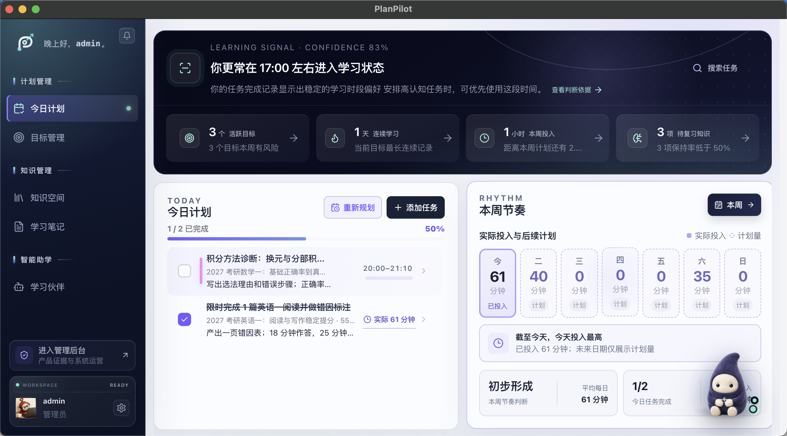
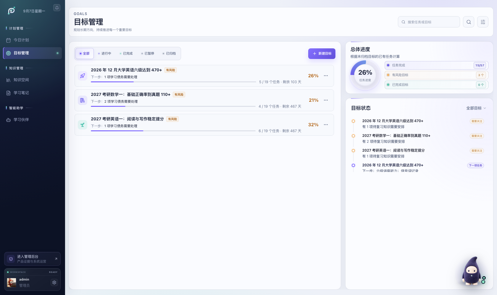
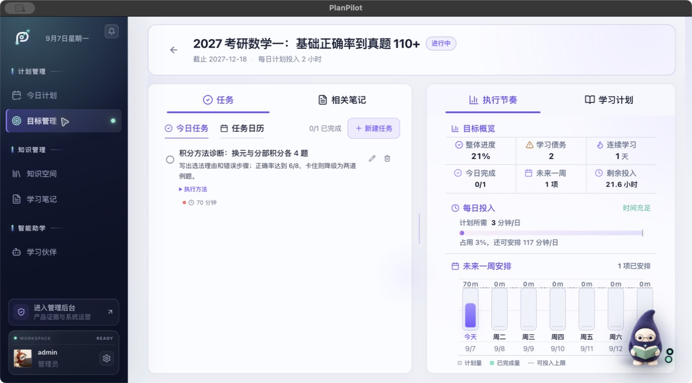
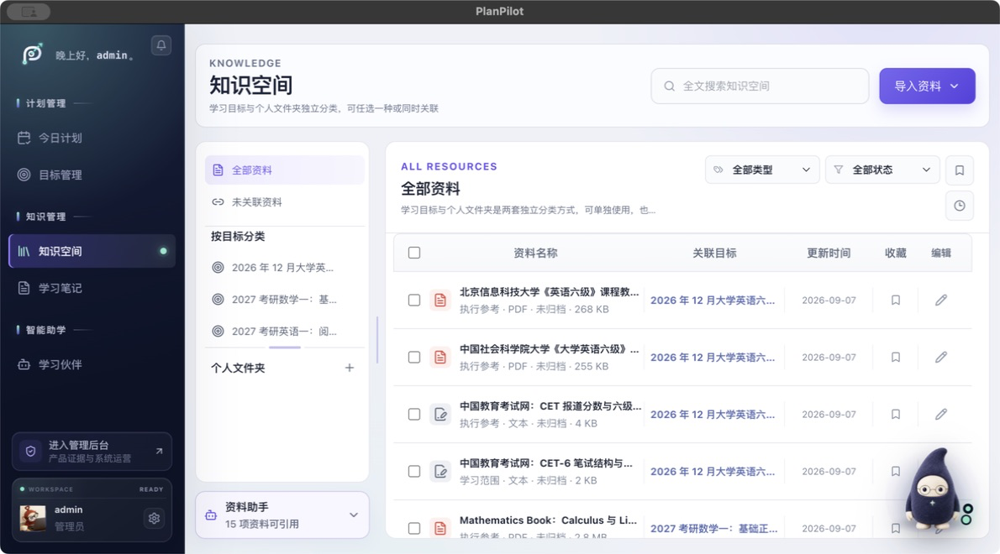
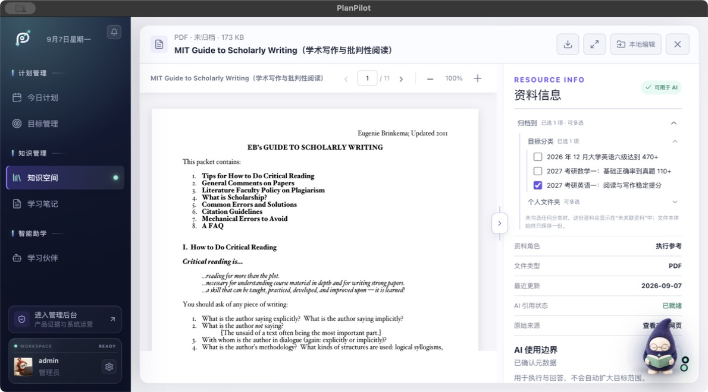
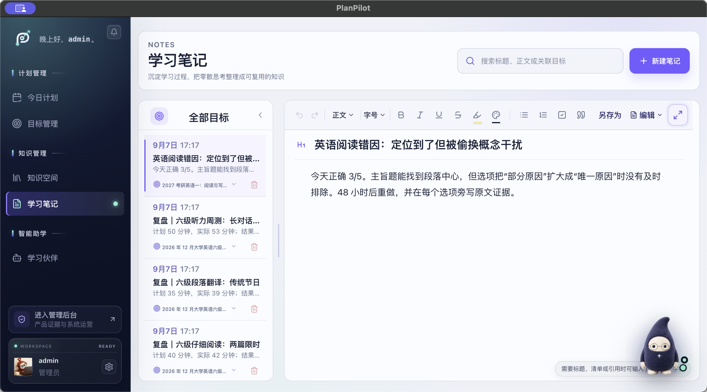
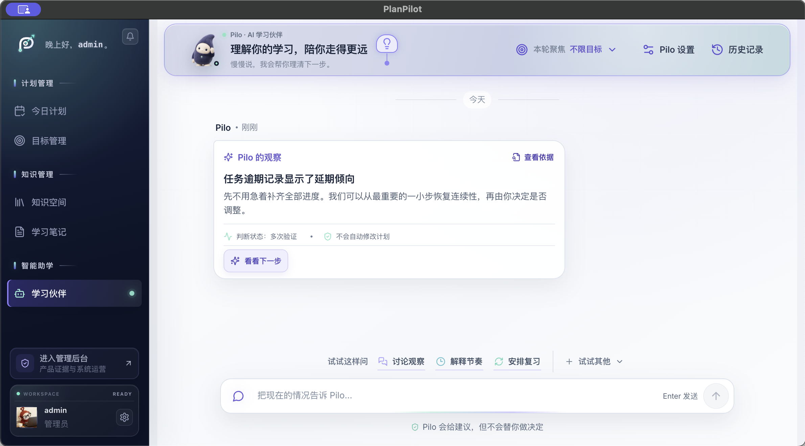

# PlanPilot｜长期学习执行与反馈工作台

[产品官网](https://planpilot-website.planpilot-wxyra.workers.dev/)

> 把目标变成今天能做的行动，把偏差变成可恢复的计划，把完成变成可验证的掌握。

- **项目阶段：** 个人 0→1 可运行 MVP，正在验证核心闭环与 AI 安全边界。
- **我的职责：** 产品定位、用户场景、信息架构、交互设计、AI 工作流、验收口径与全栈落地。
- **产品形态：** 官网负责介绍与下载；Web 提供跨设备学习工作台；Desktop 复用同一共享学习空间，并逐步增加本机文件、离线与隐私能力。

## 用户问题

PlanPilot 面向同时推进多个长期目标、时间又持续被课程、工作和临时事务打断的学习者。当前重点验证样本是一名大三学生：白天需要上课，同时准备 2027 考研英语一、数学一和 2026 年 12 月大学英语六级。

这类用户通常不缺课程、资料、笔记或 AI 工具，缺的是一条能持续数月运行的执行链路：

- 长期目标很明确，今天仍然不知道从哪一步开始；
- AI 生成的任务只有标题，没有步骤、资料位置和完成标准；
- 课程、班会或临时活动打断计划后，逾期任务不断堆积；
- 勾选“完成”只证明做过，无法证明理解或掌握；
- AI 建议缺少来源、影响范围和确认环节，用户不敢让它直接改计划。

因此，产品闭环被定义为：

```text
目标契约 → 资料边界 → 宏观计划 → 今日行动
→ 实际投入 / 偏差 → 笔记与掌握证据 → 下一轮调整
```

## 当前真实案例

以下截图均来自真实 PlanPilot Desktop 窗口中的已登录 admin 学习空间，不再使用访客演示数据。空间内持久化了 3 个长期目标、15 份真实上传资料、19 篇笔记、4 组 Pilo 对话，以及历史、今日和宏观计划任务。用户和学习行为是为产品验证构造的长期样本；资料文件来自公开高校、考试机构与开源项目。图片均以 Retina 原始尺寸的无损 PNG 保存，点击图片可查看清晰原图。

### 1. 今日行动：先让用户知道怎么开始



1. 每项今日行动都有目标、预计时长和执行说明，不是只有标题。
2. 完成状态与实际投入分开记录，避免把一次勾选等同于学习效果。
3. 课程占用作为当天容量约束记录，不统计为目标学习负荷。

当前示例日安排 2 项学习任务，共 125 分钟。课程与校内事务被当作正常约束，而不是用户“自律失败”。

### 2. 目标管理：长期目标与近期节奏相互约束



目标总览同时呈现进度、状态、风险和下一步。单目标页继续回答“今天推进什么”“未来一周是否排得下”。



当前数学一任务不只写“做积分题”，还包含题量、执行步骤、正确率标准和 70 分钟时间盒；右侧用剩余投入与周负荷检查计划是否现实。

### 3. 知识空间：先声明资料边界，再让 AI 使用



知识空间当前包含 6 份 PDF、1 份 DOCX 和 8 份网页正文快照，15/15 已完成解析。代表资料包括 MIT 学术写作指南、Stanford CS109 概率学习单、Imperial College 概率论讲义、开源数学教材，以及高校六级课程大纲。

资料不是只有一个网页链接。PDF 可以在产品内直接预览，同时保留原始来源、关联目标、资料角色和 AI 使用边界。



PlanPilot 将资料分为不同作用：

- **学习范围：** 决定需要学什么，可参与知识点和学习顺序候选；
- **执行参考：** 决定今天用什么学，可引用章节和片段，但不能扩大目标；
- **个人笔记：** 反映用户当前理解和偏差，不冒充权威教材；
- **掌握证据：** 用于验证是否会解释、应用或迁移。

资料元数据和知识地图属于 AI 派生资产，不等于原文事实；关键结论需要绑定来源并由用户审核。

### 4. 学习笔记：把执行过程变成下一轮输入



笔记与目标、任务和资料建立关联。它既用于记录错因、方法和反思，也能在后续计划中帮助判断“已经会什么、哪里仍不稳定”。

### 5. Pilo：解释、恢复和受监督行动



1. 长期观察来自目标、执行和偏差记录，不由单次对话随意下结论。
2. “查看依据”用于区分记录事实、系统判断和仍待验证的信息。
3. 涉及任务、日期、计划或学习画像的真实修改，必须先预览并由用户确认。

Pilo 不是替用户完全管理学习，而是把模糊目标转化为结构化候选、根据上下文解释今日行动，并在偏差后提供可恢复方案。实际写入遵守：

```text
生成草案 → 用户预览 → 用户确认 → 正式写入 → 可回读 → 可撤销
```

## 关键产品判断

### AI 负责语义，规则系统负责约束

AI 适合理解目标、资料、执行反馈和偏差原因；日期计算、可学习天数、每日容量、版本校验与真实写入由确定性系统处理。这样既保留语义能力，也能对排程和数据变更做稳定测试。

### 今日行动是长期计划在今天的投影

今日任务并非每次打开页面临时生成。目标确认后先形成可审核的阶段与宏观任务，再按截止日期、可用时间和前置关系投影到具体日期；Pilo 在情况变化时提出调整方案，而不是每天覆盖原计划。

每个可执行任务至少需要：

- 为什么现在做；
- 两步以上的执行过程；
- 使用哪份资料、哪一章或片段；
- 本次要留下什么产出；
- 如何验收完成或掌握；
- 预计时长与卡住后的降级路径。

### 完成与掌握必须分开

任务完成记录行为；练习结果、解释、作品、错因笔记和复习表现形成掌握证据。后续计划应根据证据调整，而不是只读取“是否勾选”。

### 偏差是正常输入，不是失败状态

课程、班会、身体状态和临时事务都会改变当天容量。系统需要保留原计划，说明受影响任务，并给出保底、标准或重新分配等恢复选项，由用户选择。

## AI 输入输出合同

| 场景 | 关键输入 | 输出 | 系统边界 |
| --- | --- | --- | --- |
| 目标拆解 | 目标、截止日期、当前水平、资料、可用时间 | 阶段、任务、依赖、时长、完成标准 | 排程器校验日期与容量 |
| 资料理解 | 原始正文、来源元数据、用户确认的资料角色 | 知识点、前置关系、候选顺序、引用片段 | 派生结论可追溯、可审核 |
| 偏差恢复 | 原计划、实际投入、中断原因、剩余时间 | 多个恢复方案及影响 | 确认前不写入 |
| 掌握判断 | 任务、资料、笔记、练习和历史表现 | 判断、依据、不确定性、下一步 | 证据不足时标记待验证 |

资料模式要求“仅知识库”时，任务必须引用真实片段；资料不足时系统应暴露边界，而不是补写不存在的依据。

## 当前完成度与真实性边界

| 状态 | 当前能力 |
| --- | --- |
| **已完成** | 登录后的目标、今日行动、实际投入、真实资料上传与解析、PDF 预览、资料角色与来源边界、笔记、Pilo 对话、学习观察审核与持久化数据链路 |
| **部分完成** | 知识地图目前以标题与段落结构提取为主；已有逐项审核，整图版本快照与完整撤销链仍需加强 |
| **正在推进** | Desktop 本机文件增强、离线队列、可选本地模型与本机私密空间；这些不作为当前已完成能力展示 |

当前实时 AI 宏观计划接口在本地环境仍可能返回“服务暂时不可用”。演示空间中的三个完整宏观计划来自资料驱动的确定性降级路径：模型不可用时，系统不会写入空计划，而是生成可审核的候选；实时模型推理路由仍在接入中。

## 验证记录

- 后端知识处理与 API 定向测试：35 项通过；
- Desktop 测试：41 项通过；
- 知识空间 Playwright 定向用例：2 项通过；
- 前端 TypeScript、ESLint 和生产构建通过。

这些结果证明关键流程可运行、状态可回读，不代表真实用户留存、成绩提升或商业收入。下一阶段需要继续做真实用户访谈、可用性测试与长期行为验证。

## 产品复盘

1. **没有采用端到端 AI 自动排计划。** 语义理解与确定性排程分离，牺牲少量“全自动”叙事，换取可解释、可验证和可恢复。
2. **把今日行动设为主价值面。** 用户先执行，Pilo 在需要解释、权衡或恢复时介入。
3. **把资料理解做成中间资产。** 不让模型每次从文件名或整份原文重新猜，而是维护可检查、可引用、可更新的资料地图。
4. **限制 AI 的写入权。** 预览、确认、执行、回读和撤销共同构成产品护栏。
5. **让长期反馈可由用户纠正。** 观察不是事实，用户拥有确认、修正、暂停和遗忘权。

## 数据说明

截图中的学习者身份、目标、执行记录、笔记和对话是为产品验证构造并持久化的长期样本，不是真实用户研究数据。资料文件与来源是真实公开内容。当前没有生产留存、成绩提升或收入数据，作品集将产品目标、模拟验证与真实结果明确分开。
