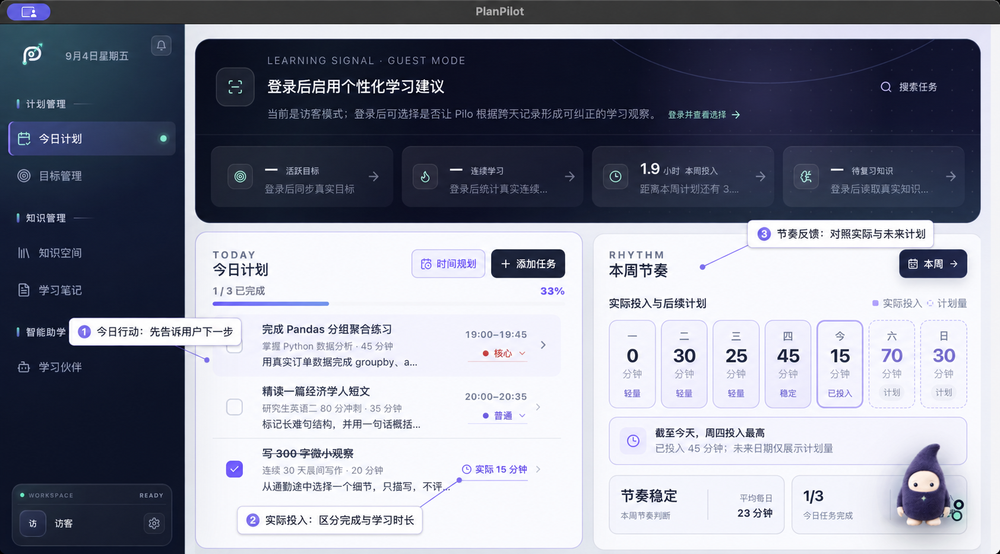
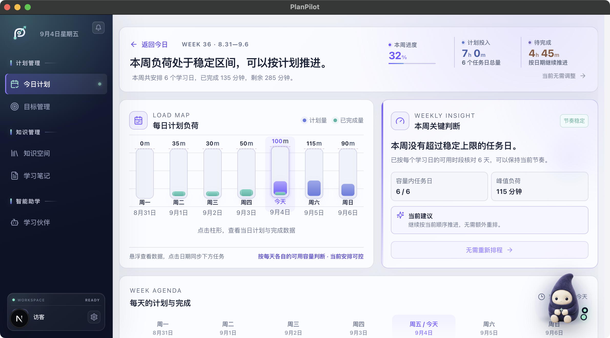
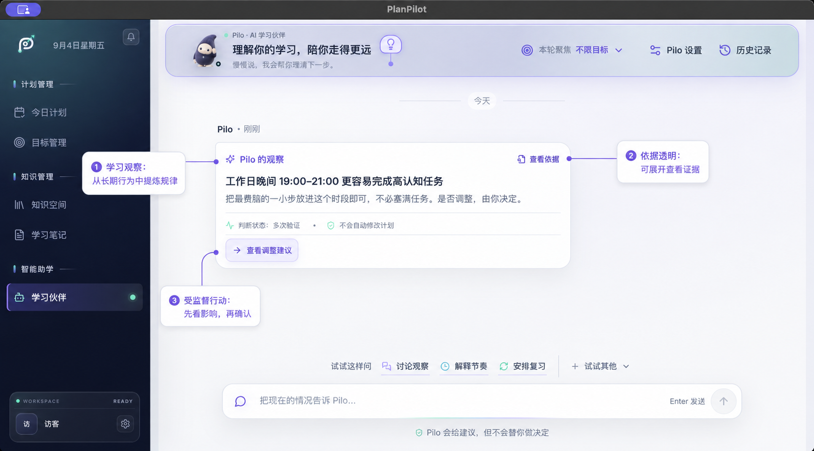

# PlanPilot｜AI 学习执行与陪伴产品

[产品官网](https://planpilot-website.planpilot-wxyra.workers.dev/) 

> 一款面向在职备考者和职业转型学习者的桌面学习工具，把长期目标拆成今天能完成的行动，并在计划被工作或生活打断后，帮助用户低成本恢复节奏。

- **项目阶段：** 个人 0→1 可运行 MVP，当前处于产品假设与核心链路验证阶段。
- **我的职责：** 产品定位、场景拆解、竞品分析、信息架构、PRD、交互设计、验收口径与 MVP 落地。

## 为什么做这个产品

我先把场景收窄到一类有明确截止日期、可用时间经常变化的成年学习者：在职备考者，以及需要完成作品集的职业转型者。

他们通常已经拥有课程、笔记、日历和 AI 工具，真正费力的是把这些工具拼成一条持续数周的执行路径：

- 计划写得很完整，今天仍然不知道先做哪一步；
- 加班或临时中断后，逾期任务不断堆积，重新排计划的成本很高；
- 勾选“完成”很容易，用户仍无法判断自己是否掌握；
- AI 给出的建议缺少来源和影响说明，用户不敢让它直接改计划。

因此，PlanPilot 的产品主线被定义为：

> **目标 → 今日行动 → 实际投入 → 学习证据 → 偏差恢复 → 下一轮计划**

## MVP 希望验证什么

本阶段关注三个问题：用户能否更快开始、被打断后能否回来、完成后能否留下可检查的掌握证据。

计划在真实测试中观察：

| 验证问题 | 指标口径 |
| --- | --- |
| 首次价值是否足够快 | 10 分钟目标建立率、24 小时首次行动率 |
| 恢复机制是否降低放弃 | 偏差发生后 72 小时恢复率 |
| 完成是否形成学习价值 | 关键任务证据率、7 日后同类任务表现 |
| AI 行动是否可信 | 未确认写入、错误回读、撤销失败均为 0 |

这些是下一阶段的验证指标，当前没有真实留存、成绩提升或收入数据。

## 核心方案与产品判断

PlanPilot 让 AI 处理需要理解语义的部分：目标、资料、当前水平、学习行为和计划偏差。日期计算、可学习天数、每日容量、任务排序和真实写入交给确定性规则。这样，AI 可以帮助用户形成方案，系统也能对时间和动作做出稳定、可解释的约束。

长期目标建立后，AI 先把目标和资料整理成阶段、任务顺序、执行说明与完成标准；排程系统再依据截止日期、可用时间和任务容量，把任务安排到具体日期。“今日行动”是这份长期计划在今天的投影。实际执行与计划出现偏差时，Pilo 才再次介入，解释冲突并给出恢复方案，用户确认后系统才修改真实计划。

日历适合安排已经明确的事项，模板适合复用固定流程，通用聊天 AI 可以即时给建议，却不会持续维护真实计划状态。PlanPilot 采用“AI 负责语义理解与方案生成，规则系统负责约束、排程和执行”的组合，正好覆盖这条持续数周的学习链路。

### 1. 今日计划：先帮助用户开始

首页首屏直接呈现今日任务、优先级、预计时长和实际投入。用户进入工作区后先看到下一步，AI 对话保留为辅助入口。

示例中包含 3 个任务：Python 核心练习、英语精读和晨间写作。完成状态与实际投入分开记录，避免把一次勾选当成学习效果。

### 2. 本周节奏：让计划是否可行一眼可见

今日页面只回答“现在做什么”，周视图继续回答“这一周是否排得下”。系统把长期计划投影到每天，显示计划量、已完成量、剩余时间与每日负荷；这些数字来自确定性排程和容量计算，不由模型临时改写。

示例中本周安排 6 个学习日，已完成 135 分钟，剩余 285 分钟，周进度 32%。负荷图把周一至周日的计划投入列出来，右侧洞察检查每天是否超过稳定上限；当前峰值为 115 分钟，系统判断仍可按当前节奏推进。点击日期后可以回到当天任务，继续记录实际投入。

这张页面承担的是计划校验和节奏反馈：用户可以在进入下一周前发现过载，也能看到“今天的安排”如何影响整个周期。

### 3. 目标管理：把长期压力换算成近期节奏

目标总览同时展示进度、剩余天数、风险和下一项行动。用户可以先处理节奏落后的目标，再进入单目标查看时间是否够用。

单目标页把任务量换算为每日负荷。示例目标剩余 12 天，未来一周安排 7 个任务，系统计算每天需要 29 分钟，占用 48% 的可投入时间。用户能据此判断计划是否现实。

### 4. 知识空间：让资料进入行动上下文

学习资料按目标关联，并显示解析、索引和 AI 可引用状态。这个设计解决两个问题：用户知道系统实际读到了什么；后续计划、解释和验收可以追溯到具体资料。

## 为什么设计 Pilo

独立聊天页会给用户增加一道“先去找 AI、再重新解释背景”的操作。Pilo 因此采用轻量常驻的陪伴形态：默认安静，不遮挡主任务；用户需要帮助时，它会带入当前页面、目标、任务或资料上下文。

这个入口刻意降低了“AI 助手”的工具感。陪伴感来自持续理解当前进度、记住用户允许保留的偏好，以及在合适的场景给出下一步；真正涉及数据修改时，仍然由用户做决定。

| 所在页面 | Pilo 承担的职责 |
| --- | --- |
| 今日计划 | 解释当前任务、回看实际投入、讨论改期和当天复盘 |
| 目标管理 | 分析进度、学习债务与时间容量，提出恢复方案 |
| 知识空间 | 围绕当前资料和目标回答，说明引用来源与处理状态 |
| 学习笔记 | 帮助整理理解、关联任务，并把讨论带回下一项行动 |
| 学习伙伴 | 跨目标观察学习节奏，讨论建议，并发起受监督行动 |

### 建议有依据，行动有确认

Pilo 的观察可以展开查看证据范围。示例建议来自 21 条近期记录，并区分“多次验证”和“仍需观察”的判断状态。

当建议会改变计划时，系统先展示影响。示例方案预计释放 95 分钟，用户可以接受，也可以保持现状；确认前不会写入任务。

### AI 的输入输出合同

Pilo 的页面入口保持轻量，但每个 AI 场景都有明确的输入、输出和验收边界：

| AI 场景 | 关键输入 | 预期输出 | 系统约束 |
| --- | --- | --- | --- |
| 目标拆解 | 目标、截止日期、当前水平、资料、可用时间 | 阶段、任务、依赖顺序、预计时长、完成标准 | 排程器校验容量并安排日期 |
| 偏差恢复 | 原计划、实际投入、未完成任务、剩余时间 | 保底／标准／冲刺方案及影响说明 | 预览确认前不写入 |
| 学习判断 | 任务、资料、笔记、练习和近期记录 | 判断、依据、不确定性和下一步建议 | 证据不足时标记“仍需观察” |

AI 任务不能只有一个标题。当前输出还要求说明 `why_now`、至少两步执行步骤、本次产出、完成标准、预计时长、资料依据与任务类型；资料模式为“仅知识库”时，每项任务必须引用真实片段。这样的合同既方便用户理解，也给后续离线评测留下了清晰口径。

### 失败兜底与模型排查

关键信息不足时，Pilo 先请求补充必要约束；资料依据不足时只提出待验证假设；输出结构不合法或违反时间容量时，校验器拒绝将其送入排程；模型或资料服务不可用时，保留原计划和手动调整路径。任何真实修改都要经过预览、确认、执行、回读与撤销。

当任务过于笼统、顺序不合理、时间不可行或资料不一致，我会按“输入完整性 → 资料检索 → 提示与结构化输出 → 排程校验 → 动作执行”的顺序排查，并用固定失败样例回放。对应的修复动作分别是补充字段、优化召回、收紧输出结构、增加确定性校验和检查写入回读；只有这些环节都排除后，才考虑更换模型。

### 如何判断 AI 创造了增量价值

下一阶段会把产品结果、模型质量和安全护栏分开看，并加入基线对照：

| 层级 | 关注指标 |
| --- | --- |
| AI 输出质量 | 可执行任务通过率、顺序合理率、资料一致率、容量约束违反率 |
| 用户结果 | 首个可执行计划生成用时、24 小时首次行动率、偏差后 72 小时恢复率、有效学习证据率 |
| 安全护栏 | 未确认写入率、执行与预览不一致率、回读失败率、撤销失败率 |

目标拆解会与固定模板或人工拆解比较形成速度和可执行性基线；偏差恢复会与用户手动调整比较恢复耗时和 72 小时恢复率；学习判断则观察建议之后是否真的完成任务并产生证据，单看“接受建议”不够。

## 当前验证结果

- 已跑通“目标建立—任务执行—实际投入—资料证据—Pilo 观察—调整预览—用户确认”的桌面端链路；
- 合成场景包含 6 个长期目标、3 个今日任务、7 天连续计划和 21 条建议依据，可稳定复现关键状态；
- 最近一次目标—计划闭环验收记录为后端定向测试 52 项通过、桌面端测试 14 项通过；
- 当前结果证明产品流程可演示、关键状态可回读，还不能代表真实学习效果。

## 我的关键决策与复盘

1. **没有采用端到端 AI 自动排计划。** AI 适合处理目标、资料和偏差中的语义判断，日期计算与容量约束则交给确定性系统。这个取舍减少了一点自动化，却换来稳定、可解释、可测试的计划执行。
2. **把“今日计划”设为主价值面。** 用户先做事，Pilo 在需要解释、权衡或恢复时出现。
3. **把中断当成正常状态。** 产品提供保底、标准和冲刺三种恢复思路，减少逾期带来的挫败感。
4. **拆开完成与掌握。** 任务完成记录行为，解释、应用和作品记录学习证据。
5. **限制 AI 的写入权。** 所有调整先展示依据和影响，再由用户确认，执行后还要回读结果。
6. **收缩近期信息量。** 长期目标保留里程碑，页面优先呈现今天和未来一周，降低维护负担。

本轮最大的迭代，是把分散的 AI 能力收拢到一条学习执行主线，并让 Pilo 随场景提供帮助。下一步将先做真实事件访谈和可用性走查，再决定是否扩大功能范围。

## 数据说明

截图中的用户、目标、任务、学习记录和指标均为合成演示数据。当前没有真实用户研究结果、生产留存或商业收入，README 中已将产品目标、模拟验证和真实结果分开表达。
