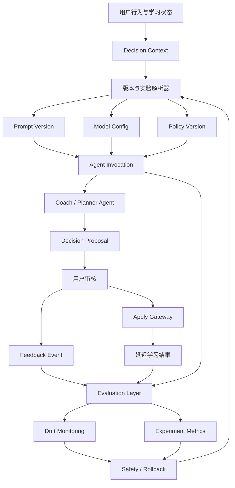

# Phase 5：Production-grade Learning Agent Architecture

状态：Phase 5 已实现  
日期：2026-07-30

## 1. 目标

Phase 5 将现有可解释智能闭环升级为可版本化、可评估、可实验、可监控、可回滚的在线 Agent 系统：

```text
行为与学习状态
  → 固定版本的 Prompt / Model / Policy
  → Agent Invocation
  → Proposal
  → 用户审核与 Apply Gateway
  → 即时反馈 + 延迟结果
  → Evaluation / Experiment / Monitoring
  → 候选策略
  → 人工或策略门禁发布
```

“持续学习”在本阶段表示从反馈和结果中持续更新评估、路由和候选策略，不表示模型可以自行修改生产 Prompt、Policy 或业务数据。

## 2. 当前真实基础

Phase 5 建立在以下现有能力上：

- `agent_runs`、`agent_steps`、`agent_approvals`：长流程编排、预算、租约、恢复和审批。
- `agent_audit_events`：Agent v2 append-only 审计轨迹。
- `DecisionContextBuilder`：Profile、Cognitive、Pattern、Memory、Knowledge Gap 与 Goal Context。
- `CoachAgent`：当前使用 `coach-v2` 学习伙伴 prompt 标识，并记录模型名、latency 和 deterministic fallback trace；`coach-v1` 保留为历史版本。
- `decision_proposals`：用户审核前的唯一业务变更入口。
- `proposal_feedback` + `ProposalFeedbackRecorded`：应用后反馈和 Pattern 信号。
- `agent_evals`：Phase 4 的 20-case deterministic benchmark 结果。
- structured logging、request ID、Agent trace、Celery Worker/Beat。

Phase 5 不替换这些模块，而是在其上增加控制平面和评估平面。

## 3. 不变的安全边界

1. Agent 不直接修改 Goal、Task、Plan、Pattern 或 Profile。
2. 业务变更继续走 `DecisionProposal → User Review → Apply Gateway`。
3. Prompt、Model、Policy version 均为不可变版本；发布只改变 deployment 指针。
4. 用户反馈不会直接激活新策略，只能产生评估信号和候选版本。
5. Experiment 只能在已批准的版本集合内分流。
6. 所有历史 Invocation 必须能还原当时使用的 prompt/model/policy/experiment 版本。
7. LangGraph checkpoint 继续由 runtime 管理，不进入 Phase 5 业务 migration。

## 4. 总体架构



## 5. 模块边界

### 5.1 Version Registry

负责 Prompt、Model、Policy 不可变版本及 deployment 指针。只负责选择运行配置，不执行 Agent。

实际模块：

```text
backend/src/services/agent_control_service.py
backend/src/services/evaluation_v2_service.py
backend/src/services/experiment_service.py
backend/src/services/feedback_learning_service.py
backend/src/services/monitoring_service.py
backend/src/api/agent_control.py
backend/src/tasks/phase5_tasks.py
```

### 5.2 Invocation Runtime

负责渲染 Prompt、调用模型、记录 token/latency/output/success/fallback，并把已有 `agent_run_id`、`proposal_id` 与 invocation 关联。

重要决策：不扩展现有 `agent_runs` 来表示每次 LLM 调用。`agent_runs` 是可恢复工作流聚合；一次 run 可能包含零到多次 LLM invocation。Phase 5 新增 `agent_invocations` 事实表。

### 5.3 Evaluation Layer

负责版本化 Dataset、Case、Run、Result、Safety Finding。Phase 4 的 `agent_evals` 保留为 benchmark v2 历史结果，Phase 5 通过适配器读取，不删除或覆盖。

### 5.4 Experiment Platform

负责实验定义、稳定分组、曝光记录、结果归因和指标比较。Experiment 不拥有 Prompt/Model 内容，只引用已批准版本。

### 5.5 Feedback Learning

负责把 Proposal 状态、显式反馈和延迟完成结果标准化为 append-only `agent_feedback_events`。它不会直接更新 deployment。

### 5.6 Monitoring & Safety

负责日指标、数据漂移、策略效果漂移、成本/延迟/错误告警、kill switch 和 rollback。回滚只切换版本指针和流量，不重写历史记录。

## 6. 计划数据模型

| 表 | Ownership | 核心用途 |
|---|---|---|
| `prompt_versions` | Version Registry | 不可变 Prompt 模板与变量 schema |
| `model_configs` | Version Registry | 不可变 provider/model/参数配置 |
| `agent_policy_versions` | Safety | 不可变安全与策略规则 |
| `agent_deployments` | Deployment | agent_type/environment 当前版本指针与状态 |
| `agent_invocations` | Runtime | 每次 Agent/LLM 调用事实、版本、成本与输出摘要 |
| `evaluation_datasets` | Evaluation | 版本化离线数据集 |
| `evaluation_cases` | Evaluation | 不可变输入、期望和标签 |
| `evaluation_runs` | Evaluation | 一次版本组合评估 |
| `evaluation_results` | Evaluation | case 级指标与 safety findings |
| `experiments` | Experiment | 实验生命周期与目标指标 |
| `experiment_variants` | Experiment | 版本组合和流量权重 |
| `experiment_assignments` | Experiment | 用户稳定分组 |
| `experiment_exposures` | Experiment | 实际调用曝光事实 |
| `agent_feedback_events` | Feedback | 标准化即时与延迟反馈信号 |
| `agent_metrics_daily` | Monitoring | agent/version/variant/segment 日指标 |
| `agent_incidents` | Safety | 告警、回滚与处置审计 |

所有时间字段遵守 Phase 4.5 `utc_now()` / naive UTC 存储契约。

## 7. 版本解析顺序

一次 Invocation 的配置必须通过单一 resolver 决定：

```text
全局 kill switch
  → 指定用户安全 override
  → 有效 experiment assignment
  → environment deployment
  → approved fallback deployment
  → deterministic fallback
```

解析结果生成不可变 `resolution_snapshot`，至少包含：

- agent_type、environment
- prompt_version_id、model_config_id、policy_version_id
- experiment_id、variant_id、assignment_id（可空）
- resolver_version、resolved_at、fallback_reason

Agent 实际执行不得再次独立查版本，避免解析后配置漂移。

## 8. Context 与隐私

- `input_context_hash` 使用 canonical JSON + SHA-256，支持同输入比较与去重。
- hash 不能替代审计上下文；如需保存快照，只允许存放字段白名单后的 redacted snapshot。
- 默认不保存完整系统 Prompt 渲染结果和用户自由文本；保存版本 ID、render hash、变量 key 清单和安全摘要。
- 输出保存结构化结果与截断后的安全摘要；原始 provider payload 不进入业务数据库。
- Evaluation Dataset 中的真实用户样本必须去标识化，并记录 consent/source/retention policy。

## 9. API 分层

```text
Router
  → Version / Evaluation / Experiment / Monitoring Service
  → Domain validation and state machine
  → Database
```

计划 API 命名空间：

```text
/api/v1/agent-control/prompts
/api/v1/agent-control/models
/api/v1/agent-control/policies
/api/v1/agent-control/deployments
/api/v1/agent-evaluation/*
/api/v1/agent-experiments/*
/api/v1/agent-monitoring/*
```

控制面 API 需要管理员权限；普通用户只能读取与自己建议有关的可解释版本摘要、实验披露和反馈状态。

## 10. 前端产品契约

所有用户可见文案必须是中文。数据库枚举和 API 可保持英文稳定值，前端通过集中映射显示中文，不直接渲染原始 status。

建议中文映射：

| API value | 中文显示 |
|---|---|
| `draft` | 草稿 |
| `candidate` | 候选版本 |
| `active` | 使用中 |
| `paused` | 已暂停 |
| `retired` | 已停用 |
| `rolled_back` | 已回滚 |
| `control` | 对照组 |
| `treatment` | 实验组 |
| `healthy` | 运行正常 |
| `warning` | 需要关注 |
| `critical` | 严重异常 |

用户侧 Coach：

- 展示“建议依据”“使用的伙伴策略版本”“反馈是否已用于改进”。
- 不显示 provider 密钥、完整 Prompt、内部策略规则或其他用户实验数据。
- 若处于实验中，使用清晰中文说明“正在体验一项学习伙伴策略改进”，并支持产品要求的退出机制。

内部运营页面：

- “版本管理”“离线评估”“在线实验”“运行监控”“安全回滚”。
- 图表标题、筛选器、空状态、错误提示和告警均使用中文。

## 11. 观测性

每次 invocation 的 trace 需要关联：

```text
request_id
trace_id
agent_run_id / step_id
agent_invocation_id
proposal_id
prompt_version_id
model_config_id
policy_version_id
experiment_id / variant_id
```

日志只记录 ID 和安全摘要。token、latency、fallback、error_category 同时进入结构化日志和 invocation facts。

## 12. 实施顺序

1. Phase 5-1：Version Registry、Invocation facts、Coach 接入与兼容回填。
2. Phase 5-2：Evaluation Dataset/Run/Result、20-case 迁移适配与 Safety evaluator。
3. Phase 5-3：Experiment、稳定分组、曝光、指标读取；初期只允许内部实验。
4. Phase 5-4：Feedback Event、延迟 attribution 和候选策略生成。
5. Phase 5-5：Daily metrics、drift detector、告警和中文监控页。
6. Phase 5-6：Policy version、渐进发布、kill switch、自动/人工 rollback。

## 13. Phase 5-0 Architecture Gate

进入代码实现前必须确认：

- 现有 `agent_runs` 与新增 `agent_invocations` 职责不混淆。
- Prompt/Model/Policy versions 不可变。
- assignment 与 exposure 分离，未实际调用不计入实验曝光。
- 反馈事件 append-only，派生指标可重算。
- Online Learning 不绕过人工/策略发布门禁。
- 所有变更动作继续使用 Proposal/Apply Gateway。
- 用户前端全部使用中文显示。
