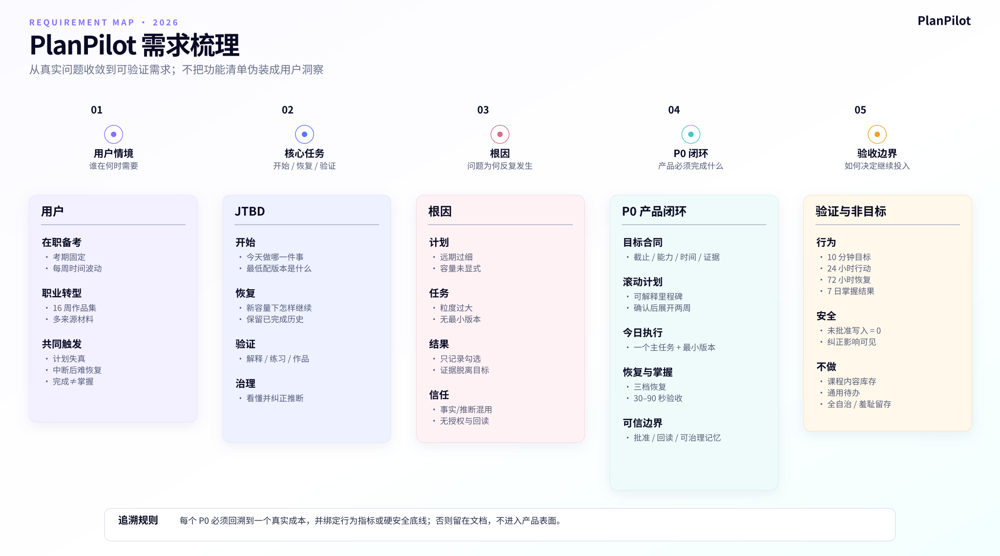

# PlanPilot 市场需求与竞品（市场需求文档 MRD）

**版本：** v2.2
**基准日期：** 2026-09-04
**文档职责：** 只维护“候选用户、待验证问题、替代方案和进入市场的证据条件”
**证据声明：** 当前没有生产收入、真实留存、完整访谈样本或可用于推算市场份额的数据

## 1. 待验证的市场判断

PlanPilot 不应从“所有想学习的人”开始，而应从目标明确、外部截止存在、时间经常被工作打断、已经尝试过计划工具却难以持续的人开始。

优先访谈候选：

> 在职证书或考试备考者。

第二批访谈候选：

> 职业技能转型或作品集建设者。

以下动机是访谈假设，不是已经得到用户确认的购买动机：

- 今天更快知道做什么。
- 加班或中断后能够低成本恢复。
- 知道完成是否真的转化为掌握。
- 不必反复向系统解释自己的目标、材料和限制。
- 长期学习数据和系统推断仍由用户控制。

## 2. 市场问题

### 2.1 用户现有方案各自只解决一段

- 课程和题库解决内容供给。
- 日历和待办解决时间与任务记录。
- 笔记和知识库解决资料整理。
- 通用模型解决即时解释与生成。
- 社群和教练解决外部监督。

用户仍需自己把这些工具连接成一条长期执行路径。计划一旦偏离，工具通常只显示更多逾期，而不是帮助恢复。

### 2.2 市场窗口

教育需求和职业技能更新持续存在，但“学习人口大”不等于 PlanPilot 的可服务市场。真正可验证的市场，是已经为课程、考试、工具或时间投入成本，并明确感到编排与恢复困难的人群。

生成式 AI 已经证明用户愿意使用对话式学习工具，但竞争正从“是否能回答”转向“是否有教学设计、个体上下文、可信行动和长期结果”。通用计划、检索和工具调用会迅速商品化，PlanPilot 必须用领域闭环证明差异。

一个常见但容易被低估的痛点是：AI 生成的计划往往只有章节或标题，用户仍不知道今天具体要做什么、要留下什么产出、做到什么程度算完成。PlanPilot 的差异不在“更会列目录”，而在把每个任务变成执行契约（为什么现在做、可直接执行的步骤、可检查产出、完成标准和资料依据），再由用户确认后进入今日行动。

## 3. 目标市场选择

| 候选市场 | 假设问题强度 | 目标触发情境 | 现有能力匹配 | 当前结论 |
|---|---:|---:|---:|---|
| 在职证书/考试备考 | 高 | 考期、课程购买、失败成本 | 高 | 优先访谈验证 |
| 职业技能转型/作品集 | 高 | 转岗、训练营、作品里程碑 | 中高 | 第二批访谈候选 |
| 隐私型技术自学 | 中 | 本地模型与数据控制 | 高 | 专项访谈候选 |
| 小团队技能提升 | 中高 | 培训预算和管理可见性 | 中 | 当前不进入 |
| 泛兴趣学习 | 中低 | 动机弱、截止少 | 中 | 暂缓 |
| 中小学独立使用 | 高敏感 | 家长或学校购买 | 低 | 当前不进入 |
| 通用个人效率 | 竞争极高 | 已有成熟替代 | 中 | 不正面竞争 |

## 4. 候选用户与目标触发假设

以下状态、触发和拒绝原因来自产品推演与替代方案分析，不是 PlanPilot 真实访谈结论。

### 4.1 在职备考者

典型状态：工作日时间碎片化，已购买课程或报名考试，计划经常被加班打断。

可能触发：

- 考期临近，多科目冲突。
- 现有 Excel、纸质计划或课程进度失真。
- 一周落后后不知道如何追回。

拒绝原因：

- “又要维护一个工具。”
- “AI 不理解我的真实时间。”
- “生成计划容易，执行还是靠我。”

### 4.2 职业技能转型者

典型状态：学习来自多门课程、文档和项目，需要作品而不是单一考试成绩。

可能触发：

- 确定转岗日期。
- 报名训练营或作品挑战。
- 课程学了很多但无法形成作品进度。

拒绝原因：

- 不提供课程内容。
- 作品质量判断不可信。
- 与 GitHub、笔记或日历割裂。

### 4.3 隐私型技术自学者

典型状态：愿意配置本地模型，不愿上传长期行为与认知推断。

可能触发：

- 希望本地优先或自主模型。
- 需要用户可见的长期记忆。

拒绝原因：

- 安装和维护复杂。
- 本地能力与云端能力差距不透明。

## 5. Jobs to Be Done（用户待办目标）

### 核心功能任务

当我有一个明确但持续数周或数月的学习目标时，我希望系统能根据截止日期、当前水平、材料和可用时间告诉我今天最值得做什么，并在计划被打乱后帮我恢复，这样我不用不断重做整份计划。

### 情绪任务

- 中断后不被工具继续惩罚。
- 对“自己是否真的推进”有把握。
- 不因 AI 的流畅表达失去判断权。

### 社会任务

- 能向导师、同事或招聘方展示学习或作品证据。
- 能解释自己的进度，而不是只展示打卡天数。

## 6. 市场定位和信息主张

### 6.1 定位陈述

对于有明确长期目标、但可用时间不断变化的成年自主学习者，PlanPilot 是一个会根据学习证据调整的 AI 学习执行系统。与通用日历、知识库或只负责答题的 AI tutor（AI 导师）不同，它连接目标、今日行动、偏差恢复、掌握证据和用户可控的学习记忆。

### 6.2 用户语言

1. 今天知道做什么。
2. 中断后能回来。
3. 完成不等于掌握。
4. AI 记忆由你控制。

不使用“75 个 ORM 模型”“175 个 API 路由”“多 Agent”或 ChangeSet（变更集）等内部术语作为普通用户卖点。工程可控是信任底座，不是购买目的。

## 7. 竞品与替代方案

| 替代类别 | 用户已有预期 | 代表产品 | PlanPilot 必须多交付什么 |
|---|---|---|---|
| 自动排程 | 自动安排任务、处理时间冲突 | Motion、Reclaim | 学习证据、掌握状态和偏差恢复 |
| 每日计划仪式 | 平静地整理今天 | Sunsama | 长期目标、学习验收和记忆 |
| 灵活工作台 | 保存资料、项目和 AI 内容 | Notion | 无需搭建的默认学习闭环 |
| AI 学习辅导 | 引导式解释和即时帮助 | Khanmigo | 跨资料、跨目标、跨时间的执行系统 |
| 游戏化学习 | 高频反馈与低门槛 | Duolingo | 支持用户自带目标和材料 |
| 纸笔/Excel | 完全可控、低成本 | 自建计划 | 显著降低维护和恢复成本 |
| 通用模型 | 低成本生成计划和解释 | ChatGPT 类产品 | 持久状态、授权行动、结果回读和长期校准 |

### 7.1 竞品判断

- Motion/Reclaim 的优势是日历自动化，弱点是不了解“学会”的证据。
- Sunsama 的优势是每日计划体验，弱点是学习状态与长期证据有限。
- Notion 的优势是灵活性，弱点是用户要自己设计系统。
- Khanmigo 的优势是教学式对话，弱点不是跨来源执行管理。
- Duolingo 的优势是封闭内容中的高频反馈，不适合任意用户目标和资料。
- 通用模型会持续压低生成与解释成本，因此 PlanPilot 不能把“会规划”本身当作差异。

## 8. 市场需求

| 编号 | 市场需求 | 优先级 | 用户价值 | 市场验收 |
|---|---|---:|---|---|
| MR-01 | 用截止日期、当前水平和可用时间建立真实目标 | P0 | 从愿望进入约束 | 无需理解复杂学习方法 |
| MR-02 | 只展开近期两周，保留长期里程碑，并先生成可审阅草案 | P0 | 降低维护负担和误写风险 | 首次计划修改量、草案理解率和确认率可测 |
| MR-03 | 今日页提供一个主任务和最小标准 | P0 | 降低开始成本 | 30 秒内知道下一步 |
| MR-04 | 提供保底、标准、冲刺恢复方案 | P0 | 中断后继续 | 72 小时恢复改善；方案选择与后续完成可追踪 |
| MR-05 | 关键任务支持解释、练习或作品证据 | P0 | 区分完成和掌握 | 7 日证据可追踪 |
| MR-06 | AI 判断显示来源、理由和影响 | P0 | 建立可纠正信任 | 用户能解释系统为何建议 |
| MR-07 | 用户能管理记忆和敏感推断 | P0 | 保持主权 | 查看、纠正、暂停、删除均可完成 |
| MR-08 | 游客与账号数据边界清楚 | P0 | 低门槛且不误导 | 用户能准确说明数据位置 |
| MR-09 | 无模型时基础功能仍可用 | P0 | 降低可用性风险 | 目标、任务、笔记可操作 |
| MR-10 | 云端和本地模型路径清楚 | P1 | 覆盖便利与隐私需求 | 安装和健康检查可接受 |
| MR-11 | 自然语言行动必须显示理解和影响 | P0 | 降低误操作 | 模糊指代先澄清 |
| MR-12 | 操作结果可验证并可撤销 | P0 | 建立可信行动 | 结果回读和撤销可见 |

下图把市场需求继续追溯到用户情境、JTBD、痛点根因、设计原则和验收证据。它用于检查需求是否有来源，不替代本节的编号与优先级。

可编辑源文件：[需求梳理 XMind](./visuals/01_需求梳理思维导图.xmind)。

MR-13 至 MR-15（外部日历/作品连接、订阅暂停、进展分享）此前属于未经确认的扩张建议，当前没有立项或完整代码能力，已从当前市场需求表移除。

## 9. 商业能力边界

当前不存在产品化的免费/Pro 权限分层，也不存在价格、试用、支付、退款、订阅暂停或取消流程。因此：

- 本文不定义套餐权益。
- 本文不提出价格档位和月付/季付方案。
- 当前研究不采集不存在的曝光、试用或支付事件。
- 商业模式必须由负责人单独确认并完成相应能力后，才能进入 MRD 的可执行需求。

当前能够研究的是用户问题、替代方案、执行成本和长期使用价值，不是尚未存在的交易漏斗。

## 10. 渠道与上市场景

优先在目标已经发生的时刻触达：

- 考试报名后。
- 购买课程后。
- 决定转岗后。
- 作品挑战启动后。

候选渠道：

- 考试和技能社群。
- 学习方法内容和课程创作者。
- 开源与本地 AI 社区。
- 真实目标有限测试招募。

传播内容应展示“中断后如何恢复”和“形成什么证据”，而不是宏大计划生成动画。

## 11. 上市条件

### 市场问题成立

- 目标访谈以最近真实事件证明编排与恢复成本。
- 用户已经使用多个替代方案或付出明显时间成本。

### 用户价值成立

- 用户能快速建立真实目标并进入首次行动。
- 至少一个核心机制改善恢复、证据或留存。

### 可持续运行成立

- 模型与基础设施成本可观测。
- 当前产品价值足以支持持续使用；商业模式另行决策。

### 可信与安全成立

- AI 写操作可确认、验证和撤销。
- 记忆可管理。
- 严重安全事件为零。

具体样本、指标和决策阈值只在 [04 用户研究、指标与验证计划](./04_用户研究_指标与验证计划.md) 维护。

## 12. Go / Hold / Pivot / Stop

- **Go：** 候选用户形成稳定留存，恢复机制有增量，运行成本可控。
- **Hold：** 问题成立，但首次体验、可靠性或建议质量仍需修复。
- **Pivot：** 用户主要需要内容和即时答题，长期执行需求弱。
- **Stop：** 多轮验证后仍只有计划生成，没有真实行动、恢复或留存。

## 13. 来源与边界

- 教育需求背景：[教育部统计公报](https://www.moe.gov.cn/jyb_sjzl/sjzl_fztjgb/202607/t20260706_1442870.html)。
- 职业技能变化：[世界经济论坛 Future of Jobs Report 2025](https://www.weforum.org/press/2025/01/future-of-jobs-report-2025-78-million-new-job-opportunities-by-2030-but-urgent-upskilling-needed-to-prepare-workforces/)。
- 教育 AI 治理：[UNESCO Guidance for Generative AI](https://www.unesco.org/en/articles/guidance-generative-ai-education-and-research?hub=66973)。
- 代表产品入口：[Motion](https://www.usemotion.com/pricing?tool=motion)、[Reclaim](https://reclaim.ai/pricing)、[Sunsama](https://help.sunsama.com/docs/billing/pricing-manifesto/)、[Notion](https://www.notion.com/product)、[Khanmigo](https://www.khanacademy.org/khanmigo)。
- 本文不提供未经验证的 TAM 收入推算、市场份额或虚构用户调查比例。
