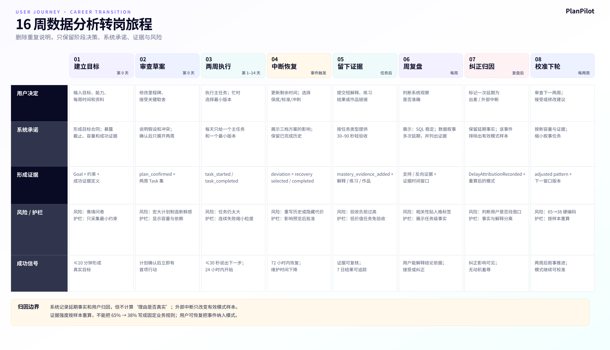
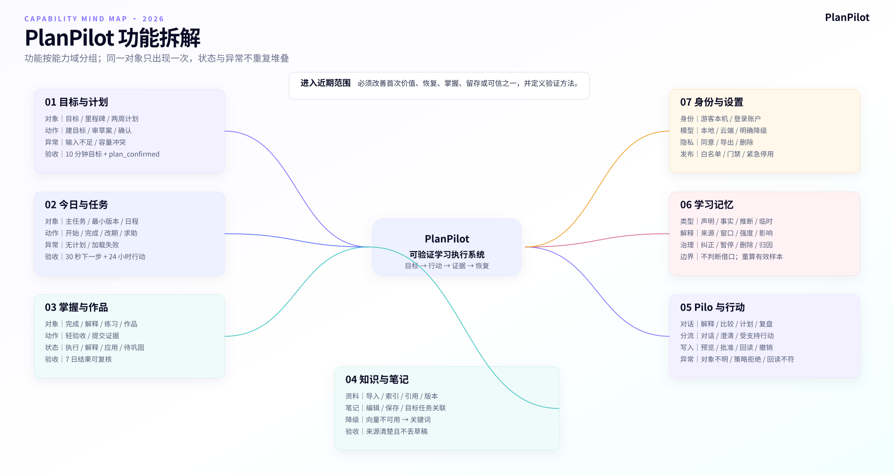

# PlanPilot 产品需求与交互说明（产品需求文档 PRD）

**版本：** v2.1
**代码基准：** 2026-09-04 当前前端与 Agent API
**适用范围：** PlanPilot 工作区与核心用户旅程
**文档职责：** 只维护“产品对象、功能范围、页面结构、交互状态和产品验收”

## 1. 产品定义

PlanPilot 是面向成年自主学习者的可验证学习执行系统：

> 把目标变成今天能做的行动，把偏差变成可恢复的计划，把完成变成可验证的掌握。

Pilo 是跨模块的理解、解释和协商入口，不替代目标、任务、知识和笔记页面中的确定性操作。只有需要自然语言消歧、批量影响评估或跨对象权衡的请求，才进入可监督行动。

## 2. 产品体验目标

1. 进入工作区 30 秒内知道下一步。
2. 10 分钟内建立一个真实目标并生成首项行动。
3. 目标、任务、材料、笔记、证据和记忆保持上下文关系。
4. 未完成被视为可恢复状态，不使用羞耻或惩罚式交互。
5. 完成和掌握分别表达。
6. AI 判断显示依据、影响和可纠正入口。
7. 写入前预览并确认，写入后验证并允许撤销。
8. 游客、本机和账号数据状态可理解。
9. 模型不可用时基础功能仍可用。
10. 桌面与 375 像素宽度都能完成核心任务。

下面是用于检查流程完整性的假设性旅程，不是真实用户研究记录。它以“在职学习者 16 周完成数据分析转岗作品集”为测试场景，覆盖目标建立、两周任务窗口、每日执行、中断恢复、掌握证据、周复盘、延期归因纠正和下一轮校准。

可编辑源文件：[用户旅程 XMind](./visuals/06_用户旅程图_职业转型作品集.xmind)。

## 3. 设计权责

| 角色 | 负责 | 不负责 | 交互表达 |
|---|---|---|---|
| 确定性系统 | 身份、日期、状态、版本、权限、审计 | 猜测用户动机 | 对象页、状态、冲突和历史 |
| AI / Pilo | 理解意图、检索上下文、解释、提出候选 | 把推断写成事实、未经确认写入 | 对话、依据、预览、风险 |
| 用户 | 目标、优先级、代价、授权和纠正 | 逐项承担所有机械维护 | 编辑、确认、拒绝、撤销 |
| 数据库回读 | 验证真实业务状态 | 相信模型或接口自报 | 已验证完成或明确失败 |

## 4. 信息架构

### 4.1 当前一级业务入口

| 分组 | 入口 | 路径 | 核心职责 |
|---|---|---|---|
| 计划管理 | 今日计划 | /studio/work | 当前行动、完成、时间和恢复 |
| 计划管理 | 目标管理 | /studio/work/goals | 目标、进度、计划和任务上下文 |
| 知识管理 | 知识空间 | /studio/work/knowledge | 用户资料、索引、搜索和版本 |
| 知识管理 | 学习笔记 | /studio/work/notes | 学习产出、目标和任务关联 |
| 智能助学 | 学习伙伴 | /studio/coach | 对话、反思与受监督行动 |
| 全局 | 设置 | /studio/settings | 账户、模型、偏好和隐私 |
| 二级 | 学习记忆 | /studio/coach/memory | 画像、规律、证据和治理 |

当前 /studio/coach/profile 重定向到学习记忆。学习记忆不是独立一级入口；建议主要在 Pilo 会话中出现。扩展页面通过对象内动作进入，不继续扩张一级导航。

### 4.2 对象关系

目标是业务容器，任务是最小执行对象，计划组织阶段，日程承载日期与时间，验收记录区分行为和掌握，知识与笔记提供依据，学习事件和记忆用于长期校准。

产品对象关系：

> 目标 → 计划 → 任务 → 日程 / 完成 / 掌握证据
> 目标 ↔ 知识资料 / 学习笔记
> 行为与证据 → 学习事件 → 可治理记忆 → 下一轮计划

功能范围按能力合同继续拆解如下。每个能力域都必须说明所服务的结果、对象、动作、状态与异常、证据；没有可观察验收结果的功能不进入近期范围。

可编辑源文件：[功能拆解 XMind](./visuals/05_功能拆解思维导图.xmind)。

## 5. 全局框架

### 5.1 桌面

- 左侧为稳定业务导航和账户区。
- 顶栏承载搜索、通知、用户与设置。
- 页面标题附近只保留一个清晰主动作。
- 内容按业务层级组织，避免卡片套卡片。
- Pilo 作为上下文入口存在，不改变信息架构。

### 5.2 窄屏

- 导航收起为可关闭的覆盖式菜单。
- 表格优先转为分组行；确需比较时才横向滚动。
- 对话、抽屉和菜单支持 Escape 关闭并恢复焦点。
- 主要触控目标接近 44×44 像素。
- 页面主动作靠近标题或当前对象。

### 5.3 全局搜索

Cmd/Ctrl + K 打开。登录用户搜索任务、目标、笔记和资料；游客搜索本机任务、目标、笔记和示例资料。结果必须标明对象类型和来源，不能把示例资料标成账号云端数据。

### 5.4 通知

通知按可行动性组织，不用提醒数量制造压力。逾期、恢复建议、验收和系统状态应有不同语言。模型失败不能伪装成普通学习提醒。

## 6. 身份与数据状态

| 状态 | 数据性质 | 页面责任 |
|---|---|---|
| 游客 | 浏览器本机、游客命名空间 | 明确“仅保存在此浏览器” |
| 登录用户 | 后端账户、按用户隔离 | 可跨会话形成长期目标和记忆 |
| 模型可用 | 支持计划、对话、验收和语义检索 | 显示 AI 生成与进行中状态 |
| 模型降级 | 基础对象仍可用，检索可退关键词 | 解释受影响能力并允许重试 |
| 离线或请求失败 | 本地草稿或现有数据可继续时保留 | 不丢用户输入，不显示假成功 |

登录后不得静默将来源不明的旧本地记录并入正式学习档案。

## 7. 核心旅程 A：首次目标到首次行动

### 7.1 当前实现

目标可新建、编辑和查看详情；目标契约（当前基础、成功标准、必须覆盖、可以跳过、其他约束）随目标保存并参与计划生成。宏观计划现在先生成草案，前端展示阶段、任务执行说明、资料引用以及替换影响；确认后才写入任务，支持取消和激活后的撤销。首登体验仍偏向展示完整产品表面。

### 7.2 目标流程（当前实现）

1. 用户描述一个真实目标。
2. 系统补充截止日期、当前水平、每周时间和成功证据。
3. 按资料边界、目标契约和可用容量生成结构化计划草案。
4. 用户查看阶段、每项任务的执行契约、资料依据、容量和替换影响。
5. 用户确认后激活并写入任务；确认前不写入任务。
6. 立即进入确认后的今日首项行动；激活后可撤销本次替换并恢复旧计划/旧任务状态。

计划状态为 `draft（草案）`、`active（已激活）`、`cancelled（已取消）`、`undone（已撤销）`。确认时校验目标契约版本和当前计划 ID，避免旧草案覆盖用户的新修改。

### 7.3 交互要求

- 首登只要求一个目标和最小约束。
- 资料、记忆和高级设置延后出现。
- 生成过程说明正在做什么。
- 时间预算不足时先暴露冲突，不生成无法执行的宏大计划。
- 计划草案按目标可学习时间窗生成连续阶段和任务，并在激活时一次性写入草案中的任务；日期由确定性排程计算，不由 AI 随意决定。产品仍应在界面上优先突出近期行动，避免用户被远期细节淹没。
- 确认前明确哪些内容会被写入。

### 7.3 任务执行契约

任务不是目录标题。每项任务至少包含：`why_now`（为什么现在做）、2—6 个 `steps`（执行步骤）、`deliverable`（可保存或检查的产出）、`done_criteria`（完成标准）；可选 `prerequisites`、`source_refs`（资料引用）和 `concept_refs`（已确认知识点引用）。目标页、今日页、学习助手和轻验收都读取同一份契约，避免生成计划与执行指导脱节。

### 7.4 资料使用边界

生成计划时可选择三种模式：

- `kb_only`：只允许使用已处理完成且有正文的关联资料；每个任务必须引用真实资料片段，资料不足时缩小范围；没有正文时直接拒绝生成。
- `kb_reference`：资料是优先依据，同时允许结合目标类型和通用知识；必须区分资料事实与系统建议。
- `no_kb`：不读取资料，按目标契约、时间和目标类型生成；不应暗示计划来自用户资料。

系统按资料分块轮询进入约 18,000 字符的上下文预算，并保存资料版本、分块、字符范围、定位和摘要，便于学习助手与验收回读。AI 可以快速整理结构，但不能保证“读完全部资料”或自动证明顺序正确；可靠性来自正文读取、结构校验、引用保存和用户预览，而不是单靠提示词。

当前知识地图接口只允许“学习范围”资料从标题和有意义段落生成来源绑定的概念候选，并复用学习概念图谱保存 `explained_by` 与候选 `prerequisite` 关系。概念支持确认、忽略和改名纠正；候选前置关系在用户确认前不会进入知识缺口和下一知识点推荐。该提取仍是确定性结构提取，不等同于模型已完成语义理解，也不证明学习顺序唯一正确。

## 8. 核心旅程 B：今日执行

### 8.1 页面首先回答

1. 今天最重要的一件事是什么。
2. 预计需要多久。
3. 最小完成版本是什么。
4. 完成后留下什么证据。

### 8.2 任务结构

- 主任务。
- 预计时长。
- 所属目标与意义。
- 最小完成标准。
- 执行步骤、产出物和资料依据（来自任务执行契约）。
- 完成、改期和需要帮助；任务开始由内部观察信号记录，不显示额外“开始”按钮。
- 完成后验收入口。

### 8.3 空状态

没有任务时，区分：

- 今天本来没有计划。
- 计划尚未生成。
- 所有任务已经完成。
- 数据加载失败。

每种状态只给一个最合理主动作。

## 9. 核心旅程 C：偏差恢复

### 9.1 触发

- 今日任务未完成。
- 多项任务逾期。
- 可用时间变化。
- 任务估时明显错误。
- 截止日期或目标优先级变化。

### 9.2 恢复方案

| 方案 | 适用情况 | 行为 |
|---|---|---|
| 保底 | 今天只能做很少 | 缩小任务，保护连续推进 |
| 标准 | 本周容量仍可调整 | 重排近期任务 |
| 冲刺 | 截止日期不可移动 | 显示代价，减少非关键任务 |

后端已返回三种候选及其代价，前端需在统一恢复入口完整消费并记录用户选择；选择方案不等于已经完成恢复，真正恢复以之后的任务开始或完成事件确认。

### 9.3 规则

- 先询问原因和新容量，不归因为自律不足。
- 保留已完成证据，不重写历史。
- 学习债务只表达待补内容，不做负面评分。
- 连续失败时收缩任务粒度。
- 批量重排先展示影响和冲突，再请求确认。

## 10. 核心旅程 D：完成与掌握

### 10.1 状态分层

- 已执行：完成阅读、观看、练习或产出。
- 已解释：能用自己的话说明。
- 已应用：能在新问题或作品中使用。
- 待巩固：当前会做，但需后续检索。

### 10.2 轻验收

根据任务类型选择 30—90 秒验收：

- 阅读或课程：用自己的话解释关键概念。
- 练习：回答一个变式问题。
- 项目：提交作品或变更证据。
- 复习：完成一次无提示回忆。

低价值、机械或时间敏感任务不强制增加验收负担。

验收题目和评分上下文同时读取任务执行契约、任务引用的资料片段及关联笔记；验收结果只记录证据类型、得分、是否通过和掌握等级，不保存答案正文或模型推理。

## 11. 目标管理

### 11.1 目标列表

- 展示目标状态、截止日期、近期风险和下一行动。
- 主动作是新建目标。
- 不用多个进度图重复表达同一信息。

### 11.2 目标详情

- 当前里程碑与下一行动置顶。
- 计划、任务、资料、笔记和证据按目标关联。
- 进度解释必须区分任务完成和掌握证据。
- 编辑目标后说明会影响哪些计划。
- 目标契约编辑会递增 `intent_version`；已有草案在激活前若版本不一致，必须重新生成或明确放弃旧草案。

## 12. 知识空间

当前支持文件或 URL、知识库、目标关联、分块、向量检索、关键词回退、重索引、版本替换和恢复。

交互要求：

- 清楚显示上传、解析、索引和失败状态。
- 只有真实索引完成后才显示“AI 已索引”。
- Embedding（向量表示）未配置时说明关键词搜索仍可用。
- 替换或删除资料前显示受影响目标和引用。
- 回答区分用户资料、系统推断和模型常识。
- 资料被计划引用时显示引用定位、版本和摘要；删除或替换资料前显示受影响计划、任务和验收引用。
- 可按目标生成资料知识地图草案，展示候选知识点、来源资料和审核状态；支持逐项确认、忽略、改名纠正和确认全部草案。
- 范围资料定义“需要学什么”；执行参考决定“行动时用什么”；笔记与掌握证据用于校准学习状态，不能自动扩大目标范围。

## 13. 学习笔记

- 编辑器保存状态可见，失败不丢内容。
- 目标和任务关联靠近笔记元数据。
- AI 辅助先展示建议，不覆盖正文。
- 快记转正式笔记需要用户主动操作。
- 任务删除后保留标题快照，避免上下文消失。

## 14. Pilo 学习伙伴

### 14.1 角色边界

Pilo 用于解释、比较、计划生成、反思和跨对象推理。单个对象的显式新增、读取、修改和删除仍保留在对象页。语言入口只有在降低消歧、批量影响评估或跨对象权衡成本时才有价值。

### 14.2 上下文层

- 长期层：用户允许的画像、规律和记忆。
- 会话层：本轮无目标或一个活跃目标。
- 对象层：从任务、目标、笔记或资料带入的当前对象。

页面应显示当前目标、来源对象和返回路径。

学习助手上下文包括目标契约、当前任务执行契约、任务引用资料和关联笔记；它可以解释“为什么现在做”、拆解步骤或帮助复盘，但不能绕过用户确认修改目标或计划。

### 14.3 对话状态

- AI 身份清楚标记。
- 流式输出并允许停止。
- 可展示引用、资料和当前目标。
- 失败区分可重试、需登录、模型未配置和安全拒绝。
- 浏览器缓存只作为离线副本，不代替账户归档。

### 14.4 受监督行动

用户提出会修改学习数据的请求时：

1. 模糊对象先追问。
2. 明确动作生成 Action Run（行动任务）。
3. 卡片展示修改前后、风险和不会静默写入的说明。
4. 用户批准、拒绝或取消。
5. 执行后做结果回读。
6. 支持时显示撤销。

后端支持编辑 ChangeSet（变更集）后重新审查和批准，当前行动卡尚无明确编辑入口，这是下一阶段缺口。完整责任链见 [05 智能行动系统机制与运行手册](./05_智能行动系统机制与运行手册.md)。

## 15. 学习记忆

每条高影响记忆至少展示：

- 结论。
- 来源事实。
- 证据时间范围。
- 置信度和不确定性。
- 对建议产生的影响。
- 准确、修正、暂停和永久遗忘。

对于“延期与恢复”观察，页面还必须支持定位到具体延期证据并记录用户归因：

- 原始延期事实不可被纠正操作删除；
- 用户可标记“出差或工作安排、生病或照护、可用时间临时下降、其他外部中断”；
- 外部中断会从重复延期模式的有效样本中排除，但仍显示在事实时间线中；
- 用户可恢复把该记录计入模式；
- 系统不得把归因解释成“用户找借口”的概率判断，只展示事实、归因和重算影响。

用户声明事实、行为事实、系统推断和临时上下文使用不同标签。临时上下文应有有效期。

## 16. 设置中心

设置按账户、学习偏好、模型与连接、隐私与数据分组。危险操作放在独立区域，解释账户删除、导出、模型连接和本地数据的后果。

主题只改变颜色与材质，不改变导航、对象关系和核心流程。

## 17. 通用状态语言

每个异步界面覆盖：

- 初始加载。
- 有数据。
- 空状态。
- 保存或执行中。
- 成功。
- 可重试错误。
- 需要用户补充。
- 安全拒绝。
- 模型降级。

行动内部状态必须翻译为中文用户语言。例如 waiting_approval（等待批准）显示“等你确认”，rolled_back（已回滚）显示“已撤销”。

## 18. 可访问性与响应式验收

- 键盘可以到达所有操作。
- Dialog、抽屉和菜单有正确焦点循环与返回。
- 图标按钮有可访问名称。
- 错误不仅依赖颜色。
- 流式内容不会反复抢焦点。
- 文字和控件在 375 像素宽度无裁切。
- 触控目标接近 44×44 像素。
- 动画尊重减少动态效果偏好。

## 19. 核心原型测试任务

1. 创建一个三个月后考试的目标，并确认首周行动。
2. 发现本周少了三小时，选择并理解恢复方案。
3. 完成一项任务并留下掌握证据。
4. 在 Pilo 中把一项任务移到明天，理解预览并撤销。
5. 找出一条影响计划的学习记忆并纠正。
6. 在游客模式说明数据存放位置。
7. 在模型不可用时继续操作目标和任务。

每项记录成功率、时间、误解、回退、确认疲劳和用户语言，而不只记录点击。

## 20. 当前实现差距

| 主题 | 当前已有 | 近期差距 |
|---|---|---|
| 主导航 | 五个一级入口和二级记忆 | 首登仍需收束为一个目标和行动 |
| 今日页 | 任务、日期和状态 | 一个主任务、最小标准和恢复入口 |
| 目标 | 新增、编辑、目标契约、详情、任务和计划 | 真实用户是否愿意填写契约并理解版本冲突 |
| 恢复 | 打卡、债务、改期、保底/标准/冲刺结果契约 | 统一入口完整消费三档方案并验证 72 小时效果 |
| 验收 | 后端与前台入口存在，读取任务/资料/笔记上下文 | 真实用户掌握增量与负担 |
| 记忆 | 页面和治理操作较完整 | 统一来源、证据窗口和影响表达 |
| 智能行动 | 预览、批准、回读和撤销 | 可见的预览编辑入口 |
| 游客 | 本地种子与本地对象操作 | 账号升级迁移承诺 |
| 异常 | 多数页面有局部状态 | 统一模型降级和路由级错误 |

## 21. 需求变更规则

任何新增功能必须改善以下至少一项：首次价值、今日行动、偏差恢复、掌握证据、长期留存或可信。无法指出所改善指标和实验方法的入口、卡片或 AI 文案，不进入近期实现。商业模式不在本规则中预设，需要单独决策。
