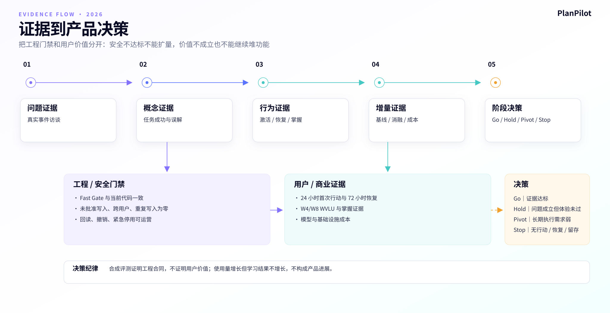

# PlanPilot 用户研究、指标与验证计划

**版本：** v2.3
**基准日期：** 2026-09-04
**文档职责：** 只维护“如何获得证据、指标怎么算、实验如何设计、达到什么条件做什么决策”
**证据边界：** 主路线事件采集、`product-validation-v2`（产品验证第二版）聚合和管理后台“用户价值验证”看板已进入代码；当前仍没有真实访谈逐字稿、足量问卷原始数据、成熟生产行为或收入数据

## 1. 研究状态

现有用户判断来自产品逻辑、行为科学、竞争格局和代码能力，是待验证假设，不是已经完成的用户研究结论。

仓库中的 30 位合成用户、60 天行为事实和 120 场 Pilo 预检可用于发现路由、审批、撤销、画像授权和回答质量问题，但合成 Persona（用户画像原型）不是用户样本。模型评分不能替代真实动机、维护负担、放弃原因和信任判断。

当前证据分三类：

- 工程证据：系统是否按合同安全运行。
- 行为证据：用户是否真实开始、恢复、留下证据和回来。
- 增量证据：完整产品是否比裸模型或简化机制更有效。

## 2. 最危险的假设

| 假设 | 当前证据 | 强度 | 下一步 |
|---|---|---:|---|
| 偏差恢复是高频、高成本问题 | 产品逻辑与替代方案观察 | 弱 | 访谈最近 14 天真实中断 |
| 用户愿从手工维护转为审查 AI 方案 | 当前行动卡可演示 | 弱 | 观察理解、拒绝、编辑和确认疲劳 |
| 用户能理解并愿意审阅宏观计划草案 | 草案预览和任务执行契约已可演示 | 弱 | 测量草案理解率、确认/取消率、确认后执行率和撤销率 |
| 目标契约的填写负担值得换取更具体的计划 | 目标契约已进入目标表单和计划上下文 | 弱 | 观察填写完成率、跳过字段率和计划修改量 |
| 来源绑定的资料知识地图比直接检索更能帮助用户理解路径 | 已有来源定位、草案/确认/忽略/纠正状态和确认后反馈链路；尚无用户效果证据 | 无 | 对照无地图、直接检索和地图+原文引用三组，测来源准确率、草案确认率、关系纠正率、计划理解率和确认耗时 |
| 掌握证据值得额外操作 | 学习科学提供机制依据 | 中弱 | 对照轻验收和无验收 |
| 可治理记忆增加信任 | 页面和治理能力存在 | 弱 | 测试来源、纠正和删除理解 |
| 长期状态优于一次性计划 | 技术原材料存在 | 弱 | 裸模型基线与纵向实验 |
| 是否存在可持续商业模式 | 没有定价、套餐、支付或订阅能力，也没有商业决策 | 无 | 不纳入当前研究执行；需要负责人单独立项后再写方案 |
| 本地模型形成差异 | 有部署能力 | 弱 | 测量安装成功、使用和支持成本 |

## 3. 研究对象

### 3.1 首发招募

- 18 岁以上。
- 有明确考试日期或作品里程碑。
- 目标周期至少四周。
- 过去一个月真实使用过课程、计划、日历或笔记工具。
- 至少经历过一次因工作或生活中断而重排计划。

### 3.2 样本结构

- 在职证书或考试备考者为主。
- 职业转型或作品集用户为辅。
- 少量隐私型技术用户用于本地模型和记忆治理研究。
- 不用便利样本代替目标样本，不把团队成员视为目标用户。

## 4. 研究计划

以下阶段、时长和样本数是研究方法建议，尚未形成招募计划或负责人批准；执行前需要根据资源、风险和真实样本可得性重新确认。

### 阶段一：问题发现，2 周

目标：确认编排、恢复和掌握判断是否真实存在。

- 访谈 15—18 名目标用户。
- 走查最近 14 天真实日历、计划和中断。
- 收集用户实际使用的替代方案。
- 不先展示 PlanPilot 功能。

输出：

- 高频真实事件。
- 当前解决方法与成本。
- 用户语言和关键异议。
- 首发场景是否继续的建议。

### 阶段二：概念和可用性验证，1—2 周

- 每个核心概念至少 5 名目标用户。
- 测试目标建立、今日行动、偏差恢复、轻验收、行动预览和记忆纠正。
- 记录任务成功、耗时、误解、回退和情绪，不只收集喜好。

### 阶段三：封闭 Beta（有限范围测试），4—6 周

- 30—50 名带真实截止日期或作品里程碑的用户。
- 先白名单，再依据安全与价值证据决定是否进入 5%。
- 每周结合行为数据和定性回访。
- 重点复核错误行动、漏掉行动、不必要澄清、大幅编辑、快速撤销和执行失败。

### 阶段四：长期价值复核，4 周以上

- 只观察已经完成首次价值的用户是否继续形成行动、证据和调整闭环。
- 结合 W4/W8 队列回访中断、恢复、维护负担和停止使用原因。
- 不在本阶段展示价格、测试套餐或采集支付事件；当前产品没有这些能力。
- 商业模式若要验证，必须先由负责人明确目标、范围和实现计划，再单独修订本文。

## 5. 访谈框架

### 开场与筛选

- 你现在最重要的学习目标是什么。
- 截止日期和失败代价是什么。
- 最近使用哪些课程、资料和工具。

### 最近一次真实事件

- 上一次计划被打乱发生了什么。
- 你如何决定删、改、推迟或补做。
- 重新规划用了多久。
- 最终是否回来，为什么。

### 完成与掌握

- 你如何判断一项任务完成。
- 你如何知道自己学会。
- 最近一次“做完但没学会”是什么。

### AI 与信任

- 什么情况下愿意让 AI 修改计划。
- 什么信息必须在确认前看到。
- 什么错误会让你停止使用。
- 你是否需要编辑、拒绝和撤销。

### 记忆与隐私

- 哪些信息可以长期保存。
- 哪些推断你希望看到来源。
- 什么情况下应该自动失效。
- 你如何理解暂停、删除和导出。

### 替代方案与现实成本

- 现在使用哪些课程、日历、任务或笔记工具。
- 为维持计划投入了多少时间和手工操作。
- 什么情况下会停止使用或切换方案。

## 6. 北极星指标

### WVLU

WVLU = 每周完成可验证学习闭环的活跃用户。

最低定义：

1. 围绕一个有效目标完成至少一个真实今日行动。
2. 留下完成或掌握证据。
3. 产生一次复盘、偏差恢复或下一步调整。

WVLU 不等于登录用户、对话用户、任务勾选用户或计划生成人数。

当前代码口径进一步收紧为：在同一用户生命周期周、同一目标下，同时出现 `TaskCompleted（任务完成）`、`MasteryEvidenceAdded（掌握证据已添加）` 或 `MasteryRecorded（掌握状态已记录）`，以及 `CheckinSubmitted（打卡已提交）`、`RecoveryCompleted（恢复已完成）` 或 `TaskRescheduled（任务已改期）` 中至少一项。三个条件缺一不可，跨目标事件不能拼成一个 WVLU。

## 7. 指标树

### 7.1 获取

- 当前不计算访问、渠道或获客成本；仓库没有完整的访问归因链。
- 现阶段从“已授权产品分析的注册用户”开始计算目标建立率。

### 7.2 激活

- 10 分钟目标建立率。
- 24 小时首次真实行动率。
- 首次行动证据率。
- 从目标到今日主任务的时间。
- 宏观计划草案理解率（用户能复述至少一项任务的步骤、产出和完成标准）。
- 草案确认率、取消率、确认后 24 小时任务开始/完成率、激活后撤销率。
- 目标契约填写完成率、字段跳过率及其与计划编辑量的关系。
- 资料地图生成成功率、来源覆盖率、无来源节点比例、前置关系纠正率和地图确认率。

### 7.3 执行与恢复

- 今日主任务开始率和完成率。
- 计划偏差发生率。
- 偏差后 72 小时恢复率。
- 恢复方案选择和后续完成。
- 每个 WVLU 的手工维护时间与操作数。

### 7.4 掌握

- 关键任务轻验收参与率。
- 解释、应用和作品证据比例。
- 7 日后同类任务或回忆结果。
- 系统判断与用户修正差异。

### 7.5 留存

- W1/W4/W8 WVLU 留存。
- 连续有效学习周。
- 目标周期完成率。

### 7.6 可信与安全

- 未确认写入。
- 跨用户访问。
- 重复写入。
- 审查与批准绑定失败。
- 结果回读不一致。
- 撤销或补偿失败。
- 记忆纠正和删除失败。

## 8. 智能行动诊断漏斗

> 意图识别 → 澄清完成 → 变更预览 → 风险审查 → 用户批准 → 执行 → 结果回读 → 保留或撤销

记录：

- 对话误触发行动率。
- 行动漏识别率。
- 一次解析完整率。
- 澄清后完成率。
- 预览编辑、拒绝和取消原因。
- 批准后回读通过率。
- 7 日行动和恢复结果。

批准率不是越高越好，撤销率低也不一定好。必须结合理解、错误、后续结果和入口可见性解释。

## 9. 主路线埋点与指标口径

### 9.1 采集原则

- 领域事实由后端写入 append-only（只追加）`LearningEvent（学习事件）`，与目标、任务、打卡或掌握状态在同一事务提交。
- 页面曝光、预览或模型推荐不能冒充用户已选择、已行动或已恢复。
- 业务事件可以支持产品运行；产品验证聚合只纳入当前 `product_analytics_enabled=true（已开启产品分析）` 的用户。
- 所有时间窗采用左闭右开，即包含起点、不包含终点；例如 `[0,24小时)` 不包含恰好第 24 小时。
- 用户级指标每位用户只计一次；恢复指标每个偏差只计一次；事件重试通过 `idempotency_key（幂等键）` 去重。
- 验收事件只保存证据类型、得分、是否通过和掌握等级，不保存用户答案正文，也不保存模型推理内容。
- 当前数据库业务时间为 naive UTC（无时区标记的协调世界时）；W4/W8 按首个目标创建时间计算生命周期周，不按自然周拼接。

### 9.2 事件字典

| 代码事件 | 中文含义 | 真实触发条件 | 关键字段 | 当前状态 |
|---|---|---|---|---|
| `GoalCreated` | 目标已创建 | 用户或经批准的 Agent 真正写入目标成功 | `goal_id`、来源、目标版本 | 已实现 |
| `TaskStarted` | 任务已开始 | 任务进入已确认执行时段且用户在今日页形成前台活动，或首次部分打卡、记录大于 0 的实际投入、完成任务时幂等补记 | 任务、目标、触发信号、原状态、计划日期、预计分钟 | 已实现；单纯确认时间安排不计，界面不显示“开始”按钮，每任务只记首次开始 |
| `TaskCompleted` | 任务已完成 | 任务页勾选完成、打卡完成或经批准的 Agent 完成任务 | 任务、目标、完成时间、实际/预计分钟、来源 | 已实现；三条写入路径统一 |
| `CheckinSubmitted` | 打卡已提交 | 用户提交日常、清单、快速或自然语言打卡 | 本地日期、完成率、掌握率、任务数、投入分钟 | 已实现 |
| `DeviationDetected` | 偏差已检测 | 用户跳过任务、连续计划日低执行，或确认“负荷恢复”改期 | 偏差类型、检测规则、任务/目标、72 小时窗口 | 已实现；不把普通手工改期视为偏差 |
| `RecoverySelected` | 恢复方案已选择 | 用户确认带恢复语义的改期；只看预览不计 | 偏差事件、任务、触发原因、策略、前后日期 | 已实现；当前首页接入 standard（标准恢复） |
| `RecoveryCompleted` | 恢复已完成 | 明确偏差后 72 小时内，对同目标产生首次 `TaskStarted（任务开始）` 或 `TaskCompleted（任务完成）` | 偏差事件、行动事件、任务、延迟小时 | 已实现；每偏差最多一次 |
| `MasteryAssessmentSubmitted` | 掌握验收已提交 | 用户提交一次轻验收答案，不论通过与否 | 证据类型、得分、是否通过；不含答案正文 | 已实现 |
| `MasteryEvidenceAdded` | 掌握证据已添加 | 轻验收通过，或打卡提交明确掌握自评 | 证据类型、质量、得分/等级、是否通过 | 已实现 |
| `MasteryRecorded` | 掌握状态已记录 | 手工修改、打卡掌握更新或轻验收通过 | 原等级、新等级、提交方式、得分 | 已实现 |
| `TaskRescheduled` | 任务已改期 | 用户或经批准的 Agent 真正写入新日期 | 原日期、新日期、触发原因、恢复策略 | 已实现 |
| `MacroPlanDraftGenerated` | 宏观计划草案已生成 | AI 通过结构校验并保存草案，尚未写入任务 | 计划、目标契约版本、资料模式、资料摘要 | 已实现 |
| `MacroPlanActivated` | 宏观计划已激活 | 用户确认草案且任务写入、回读成功 | 计划版本、替换计划、任务数、目标契约版本 | 已实现 |
| `MacroPlanDraftCancelled` | 宏观计划草案已取消 | 用户在确认前取消草案 | 计划、取消原因（如有） | 已实现 |
| `MacroPlanActivationUndone` | 宏观计划激活已撤销 | 用户撤销本次替换并恢复旧计划/任务状态 | 新旧计划、恢复任务数、冲突 | 已实现 |

智能行动系统另有 `ConversationTurnReceived（收到对话）`、`NeedFrameResolved（需求框架已解析）`、`IntentResolved（行动意图已解析）`、`preview.ready（预览已就绪）`、`approval.approved（审批已通过）`、`completed（执行已完成）`、`rolled_back（已回滚）` 等审计事件。它们用于诊断路由和安全执行，不能替代上表的用户价值事实。

### 9.3 指标公式、分母与时间窗

| 指标 | 分母 | 分子 | 时间窗与去重 | 决策角色 |
|---|---|---|---|---|
| 10 分钟目标建立率 | 注册已满 10 分钟且已授权产品分析的用户 | 注册后 `[0,10分钟)` 创建首个目标的用户 | 每用户一次；未满 10 分钟不进分母 | 首登效率 |
| 24 小时任务开始率 | 首个目标已创建满 24 小时的授权用户 | 目标后 `[0,24小时)` 出现 `TaskStarted（任务开始）` 或 `TaskCompleted（任务完成）` | 每用户一次；完成事件兼容没有开始事件的历史路径 | 诊断指标，不作为最终激活 |
| 24 小时激活率 | 同上 | 目标后 `[0,24小时)` 至少完成一项同目标任务 | 每用户一次；必须是 `TaskCompleted（任务完成）` | 当前激活主指标 |
| 首次行动证据率 | 已在目标创建后 24 小时内完成首项任务，且该首次完成已满 24 小时的授权用户 | 首次任务完成后 `[0,24小时)` 留下同目标掌握状态或掌握证据 | 每用户一次；首次完成未满 24 小时不进入分母 | 判断完成是否可验证 |
| 恢复方案选择率 | 最近 28 天内已经完整观察 72 小时的明确偏差 | 产生 `RecoverySelected（恢复方案已选择）` 的偏差 | 每偏差一次；预览不计 | 判断方案理解和接受 |
| 72 小时恢复率 | 同上 | 偏差后 `[0,72小时)` 产生 `RecoveryCompleted（恢复已完成）` 的偏差 | 每偏差一次；恰好第 72 小时不计 | 当前恢复主指标 |
| W4 WVLU 留存 | 已在 24 小时激活，且首个目标已满 29 天的用户 | 目标后第 22 天（含）至第 29 天（不含）满足同目标 WVLU 三条件 | 每用户一次 | 当前留存主指标 |
| W8 WVLU 留存 | 已在 24 小时激活，且首个目标已满 57 天的用户 | 目标后第 50 天（含）至第 57 天（不含）满足同目标 WVLU 三条件 | 每用户一次 | 长期观察，不作为首轮放量阻塞项 |
| 28 天过载代理率 | 最近 28 天 `TaskCompleted（任务完成）`、`TaskSkipped（任务跳过）`、`TaskRescheduled（任务改期）` 事件总数 | 其中任务跳过和任务改期事件数 | 事件级；它是维护负担代理，不等于用户主观过载 | 护栏指标 |

统一公式：`比率 = 去重后的合格分子 ÷ 已成熟且合格的分母`。分母为零时返回 `null（暂无可计算数据）`，不能返回 0，也不能把未成熟用户提前算作失败。

### 9.4 WVLU 的可计算条件

对用户 `u`、目标 `g`、观察周 `w`：

`WVLU(u,g,w) = Action ∧ Evidence ∧ Adjustment`

- `Action（真实行动）`：该周同一目标至少一个 `TaskCompleted（任务完成）`。
- `Evidence（学习证据）`：该周同一目标至少一个 `MasteryEvidenceAdded（掌握证据已添加）` 或 `MasteryRecorded（掌握状态已记录）`。
- `Adjustment（复盘或调整）`：该周同一目标至少一个 `CheckinSubmitted（打卡已提交）`、`RecoveryCompleted（恢复已完成）` 或 `TaskRescheduled（任务已改期）`。

同一用户一周有多个目标满足时，在用户级留存中仍只计一人；需要目标级诊断时可以分别展开，但不能把目标 A 的完成、目标 B 的证据和目标 C 的打卡拼成一次闭环。

### 9.5 当前代码映射

- 事件基础设施：[publisher.py](../../backend/src/events/publisher.py)。
- 任务开始、完成、改期与恢复选择：[task_service.py](../../backend/src/services/task_service.py)。
- 打卡完成、掌握证据与偏差检测：[checkin_service.py](../../backend/src/services/checkin_service.py)。
- 72 小时恢复因果关联：[learning_lifecycle_service.py](../../backend/src/services/learning_lifecycle_service.py)。
- 轻验收证据：[agent.py](../../backend/src/api/agent.py)。
- 指标聚合和代码内口径说明：[product_validation_service.py](../../backend/src/services/product_validation_service.py)。
- 管理员读取最新快照、历史快照和手动重新聚合：[agent_control.py](../../backend/src/api/agent_control.py)。读取最新数据不会顺带写入新快照，只有管理员明确点击“重新计算”才会产生新快照。
- 运营看板：[ProductValidationPage.tsx](<../../frontend/app/(admin)/admin/_components/ProductValidationPage.tsx>)，入口为 `/admin/product`。页面必须同时展示比例、成熟分子/分母、观察窗口和是否达到工程预设线。
- 聚合验证：[test_product_validation.py](../../backend/tests/test_product_validation.py)；事件验证：[test_learning_events.py](../../backend/tests/test_learning_events.py)。

### 9.6 兼容、缺口与禁止外推

- `product-validation-v2（产品验证第二版）` 已替换旧的“7 天完成 3 个任务”和“第 22—35 天任意事件”口径；旧口径不得继续用于发布结论。
- 历史数据没有完整 `TaskStarted（任务开始）`，因此 24 小时任务开始率把同窗 `TaskCompleted（任务完成）` 作为已开始的保守兼容信号；24 小时激活率不受该兼容影响。
- 确认日程只产生“已安排”事实，不产生 `TaskStarted（任务开始）`。只有当前时间处于已持久化时间块且用户打开今日页，或后续出现部分打卡、大于 0 的实际投入、任务完成时才记录；未来时段和历史日期不计。
- 改动上线前的学习验收通过记录没有 `MasteryEvidenceAdded（掌握证据已添加）`，不能从聊天正文回填，避免扩大敏感内容处理范围。
- 当前首页的负荷调整只接入 `standard（标准恢复）`；`minimum（保底恢复）` 和 `sprint（冲刺恢复）` 只有事件枚举与后端校验，不能表述为已完成三档产品体验。
- 游客数据停留在本机，不进入登录用户产品验证队列；不能把访客示例行为并入真实激活率。
- PMF 问卷已有后端接口，但尚无完整前端采集体验；问卷数量不足 40 时产品验证状态必须为 `insufficient_data（数据不足）`。
- 当前代码完成不等于已有用户效果。没有成熟真实队列时，所有比率只能显示暂无数据，不能用合成用户填充。

## 10. 核心看板

### 当前管理后台：用户价值验证

后台使用运营能直接理解的中文展示，不把内部事件名、模型路由词或英文缩写当作主标题。首屏保持高信息密度，但不牺牲字号和对比度：

- 顶部判断条：证据仍在积累、关键指标需要改善或达到当前预设线，同时显示授权用户数和更新时间。
- 四个核心指标：10 分钟建好目标、24 小时完成首次行动、第 4 周仍有学习闭环、中断后 72 小时内恢复。
- 首次价值路径：建好目标、开始任务、完成任务、留下证据；用来定位用户在哪一步停下。
- 偏差恢复、长期闭环和负担护栏使用紧凑列表，不重复堆叠大卡片。
- 只有至少两个真实快照时才显示趋势线；没有成熟分母时显示“暂无数据”或“等待成熟样本”，不得显示为 0%。
- 当前阈值统一标注为“工程预设，尚未经过真实用户校准”，不得包装成已经验证的业务目标。

管理后台的“产品验证”“行动验证”“灰度发布”“实验与评估”“模型网关”和“调用审计”职责分开。用户价值指标不能混入模型成功率，行动功能漏斗也不能替代用户真实完成、恢复和长期闭环。

后台请求也按页面职责拆分：总览只读取决策摘要，产品验证读取产品快照，行动验证读取行动漏斗，灰度发布读取门禁和发布状态，网关与审计分别读取各自运行数据。进入一个页面不会再为了显示无关卡片加载全套后台数据。

### 管理层周报

- 合格新用户和 24 小时激活。
- WVLU 与 W4/W8 趋势。
- 偏差恢复和掌握证据。
- P0 安全事件。
- 本周证据改变了什么决策。

### 产品诊断

- 首登漏斗。
- 今日任务和恢复路径。
- 轻验收参与及 7 日结果。
- 智能行动误触发、澄清、批准、回读与撤销。
- 学习记忆查看、纠正、停用和删除。
- 模型、本地、云端与关键词降级分布。

## 11. 候选实验（尚未实施）

以下是研究设计备选，不代表已经开发、分流或运行。任何实验必须先明确负责人、样本、风险和停用条件；当前代码中存在实验基础设施，不等于这些实验已经上线。

| 实验 | 假设 | 主指标 | 护栏 |
|---|---|---|---|
| 一个今日主任务 vs 普通任务列表 | 降低开始成本 | 24 小时激活 | 完成质量 |
| 三档恢复 vs 手工改期 | 中断后更容易回来 | 72 小时恢复 | 确认疲劳 |
| 轻验收 vs 无验收 | 增加可验证掌握 | 7 日证据、W4 WVLU | 完成率、成本 |
| 可解释记忆 vs 隐式个性化 | 增加信任和纠正 | 建议采纳与纠正质量 | 删除失败、投诉 |
| 完整闭环 vs 同模型一次性计划 | 领域机制有增量 | W4 WVLU、恢复 | 维护时间、模型成本 |
| 纵向记忆 vs 无长期状态 | 长期状态提高匹配 | 恢复和计划接受 | 错误推断 |
| 本地优先 vs 云端优先 | 隐私价值大于配置成本 | 激活与留存 | 安装失败、支持成本 |

## 12. 创新增量验证

### 裸模型基线

同一基础模型、同一目标输入，只提供一次性对话或计划，不接入长期状态和恢复闭环。

### 机制消融

分别移除：

- 偏差恢复。
- 掌握证据。
- 长期记忆。
- 用户批准与结果回读。

观察完整系统相对各版本的增量和成本。

### 模型降级

保持产品机制不变，更换模型能力等级。若价值随模型更换完全消失，说明优势主要来自模型红利；若领域闭环仍产生增量，才可能形成产品壁垒。

## 13. 决策门槛

### 进入真实白名单前

- Fast Gate（快速回归门禁）全绿。
- Runtime Gate（运行时安全门禁）与当前部署、代码和迁移绑定且未过期。
- 未确认写入、跨用户访问、重复写入和审查绑定失败均为零。
- 复核队列和紧急停用开关可运营。

### 从白名单进入 5% 前

- 没有严重安全事件。
- 关键行动可审计、回读和撤销。
- 用户能理解预览、确认和失败语言。
- 回答质量达到可接受底线。

### 阶段性产品目标

以下数值是当前代码沿用的工程门禁默认值，不是用户研究结论，也没有经过 PlanPilot 真实基线校准。它们只能帮助检查聚合链是否可运行；在负责人确认和真实样本校准前，不得单独据此做上线或商业决策：

- 至少 30—50 名真实目标用户完成四周。
- 10 分钟目标建立率达到 60%。
- 首次目标到 24 小时激活率达到 60%。
- 激活用户 W4 WVLU 留存率达到 35%。
- 已完整观察的偏差 72 小时恢复率达到 40%。
- 最近一次 Sean Ellis PMF（产品市场匹配度）问卷中“如果无法继续使用会非常失望”达到 40%，且至少 40 份授权样本。
- 28 天过载代理率不高于 25%；同时用访谈验证其是否真的代表维护负担。
- 至少一个核心机制在对照中显示增量。

自动 `supported（证据支持）` 判定要求 PMF、10 分钟目标、24 小时激活、W4 WVLU、72 小时恢复和过载护栏同时过线，并且 PMF、目标建立、激活、W4 和恢复队列分别达到至少 40 个成熟样本。W8 由于观察周期更长，只展示，不阻塞首轮有限放量。

安全底线不因样本量小而放宽。

## 14. 研究与数据纪律

- 区分事实、推断、建议目标和待验证假设。
- 不用合成用户替代真人。
- 不用相关性宣称学习因果。
- 不只访谈高活跃或团队熟人。
- 不复制不必要的原始聊天和敏感学习内容。
- 指标定义、实验组、模型和策略必须版本化。
- 失败样本必须能追溯到路由、工具、策略和结果。
- 数据保留遵循最小化，研究结束后按规则删除或去标识。

## 15. 当前证据

2026-08-24 14:57 的历史定向基线为 70 通过、2 失败。两项失败来自同一语义合同分歧：“把它移到明天”当前进入缺任务匹配信息的澄清，而冻结用例期望普通对话。这不是未经确认写入，但在重新执行完整 Fast Gate（快速回归门禁）前，不能宣称门禁全绿。

主路线埋点的最新定向回归结果应以当日代码测试为准。当前交互不再显示“开始”按钮；前端只在已确认执行时段内形成活动时触发内部观察，完成、部分打卡或实际投入可以幂等补记首次开始。该结果只能证明采集链和口径实现可运行，不证明真实用户指标达到门槛。

详细代码事实按日期维护：历史结论见 [2026-08-24 快照](./appendices/代码事实与成熟度快照_2026-08-24.md)，本轮目标—计划闭环见 [2026-09-04 快照](./appendices/代码事实与成熟度快照_2026-09-04_目标计划闭环.md)。

合成评测详情可参考 [SyntheticPersonaV1 完整评测报告](../evaluations/synthetic-v1-20260823/完整评测报告.md)，但不得对外表述为真实用户效果。

## 16. 研究参考

- 实施意图对目标行动的支持：[Gollwitzer & Sheeran, 2006](https://www.socmot.uni-konstanz.de/publications/implementation-intentions-and-goal-achievement-meta-analysis-effects-and-processes)。
- 检索练习与长期保持：[Roediger & Karpicke, 2006](https://pubmed.ncbi.nlm.nih.gov/16507066/)。
- 在线高等教育自我调节学习综述：[Wong et al.](https://doi.org/10.1016%2FJ.IHEDUC.2015.04.007)。

这些研究支撑机制假设，不证明 PlanPilot 已经产生相同效果。
