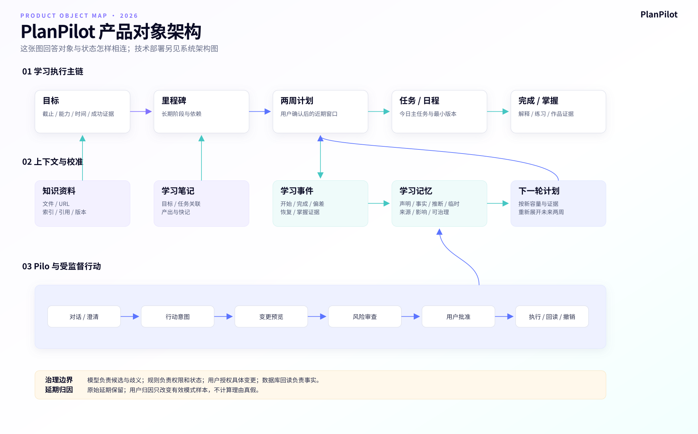
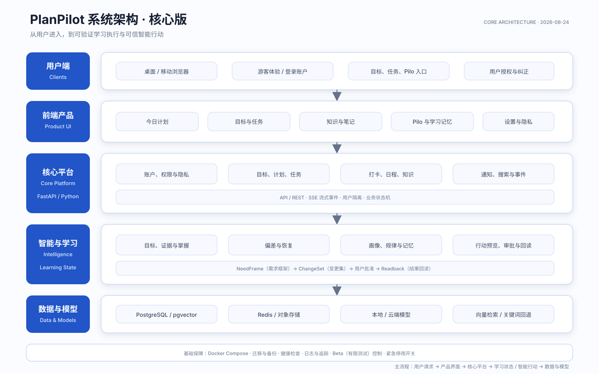
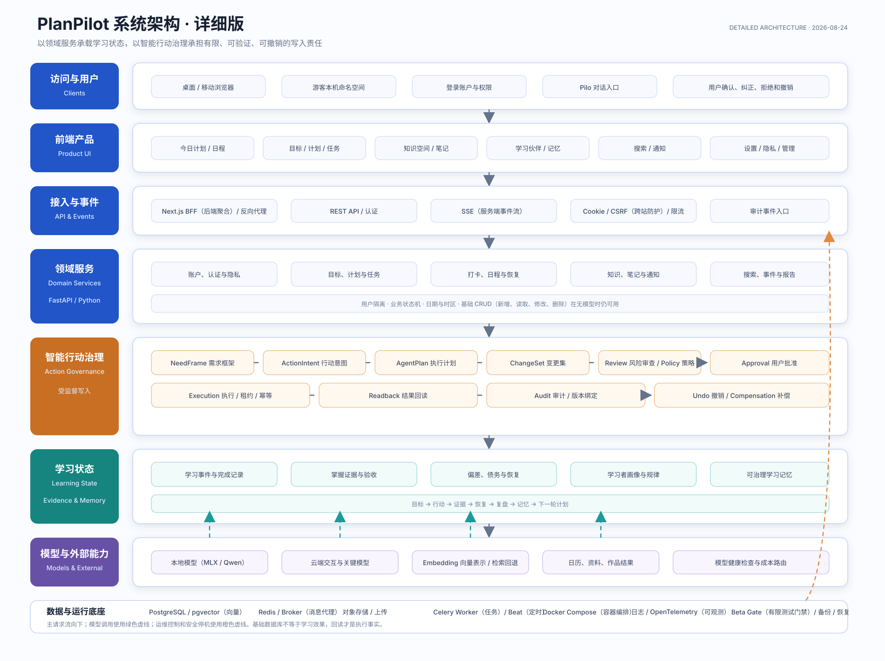
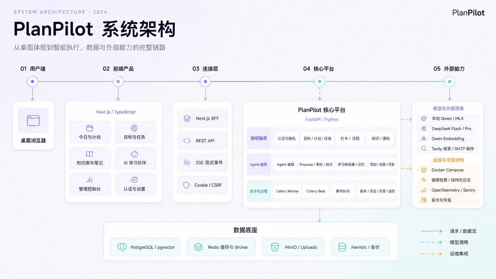
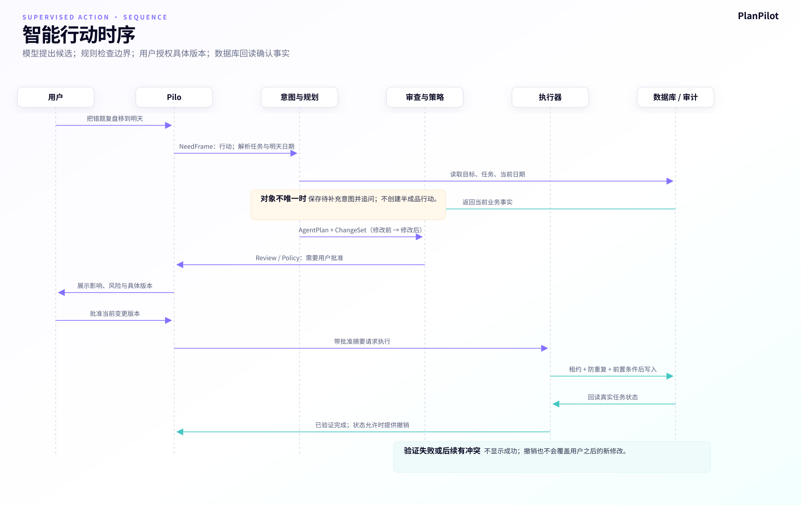

# PlanPilot 智能行动系统机制与运行手册

**版本：** v2.1
**代码基准：** 2026-09-04
**适用对象：** 产品、设计、研发、测试、数据、运营与客户支持
**文档职责：** 只维护“系统怎样可信运行、各层负责什么、失败时如何处理”

## 1. 系统架构

产品对象架构先回答目标、计划、任务、证据、资料、记忆和受监督行动怎样连接；它不重复技术部署分层。

可编辑源文件：[产品架构 XMind](./visuals/04_产品架构梳理.xmind)。

系统架构图分为两种阅读粒度：核心版用于快速沟通，详细版用于研发和架构评审。两张图都采用“访问端 → 产品 → 服务 → 智能 / 数据 → 底座”的主流向，但不把模型调用误画成普通业务写入。

原中文系统架构参考图仍保留在架构文档目录中，用于视觉和部署表达对照：

架构原则：

- 浏览器和前端负责交互与状态呈现，不成为权限最终边界。
- FastAPI 后端负责业务规则、账户隔离、智能行动编排和模型路由。
- PostgreSQL / pgvector 保存业务、知识与智能状态；Redis 和任务系统支持缓存、限流、队列和异步工作。
- 本地与云模型按任务价值路由；模型不可用时保留基础业务路径。
- 用户写入授权、执行租约、结果回读和审计不交给生成模型自由决定。

## 2. 双语术语

代码名是研发契约，不应成为用户理解成本。文档第一次出现采用“英文代码名（中文产品名）”，界面优先只展示中文。

| 英文代码名 | 中文产品名 |
|---|---|
| Agent | 智能行动代理 |
| NeedFrame | 需求框架 |
| ActionIntent | 行动意图 |
| PendingActionIntent | 待补充行动意图 |
| AgentPlan | 执行计划 |
| ChangeSet | 变更集 |
| Review | 风险审查 |
| PolicyDecision | 策略判定 |
| Approval | 用户批准 |
| Execution / Executor | 执行 / 执行器 |
| Readback / Observer | 结果回读 / 结果观察器 |
| Audit | 审计留痕 |
| Undo / Compensation | 撤销 / 补偿 |
| Action Run / Run | 行动任务 |
| Step | 执行步骤 |
| Insight | 学习洞察 |
| RAG | 检索增强生成 |
| Embedding | 向量表示 |
| SSE | 服务端事件流 |
| Fast Gate | 快速回归门禁 |
| Runtime Gate | 运行时安全门禁 |
| kill switch | 紧急停用开关 |
| Beta | 有限范围测试 |

API 指应用程序接口，HMAC 指带密钥的消息认证码，CRUD 指新增、读取、修改和删除。

## 3. 两条不同的闭环

### 目标学习价值闭环（核心链已实现，效果待验证）

> 目标 → 宏观计划（近期行动优先）→ 今日行动 → 完成 / 掌握证据 → 偏差恢复 → 周复盘 → 学习记忆 → 下一轮计划

它回答用户有没有获得学习结果。目标契约、宏观计划草案、确认激活、任务执行契约、今日行动、完成、掌握证据、三种恢复结果和记忆已有代码；统一恢复入口的前端消费、周复盘和真实学习增量仍待验证，不能把代码链路当成效果证明。

### 宏观计划受控链（专用生命周期）

> 目标契约 + 资料边界 → 正文读取/分块引用 → 结构化计划草案 → 用户预览 → 确认激活 → 任务写入 → 数据库回读 → 撤销/恢复旧计划

该链路目前复用 `Plan` 保存草案和激活计划，尚未接入通用 `AgentActionRun`。计划 `content.lifecycle.status` 使用 `draft / active / cancelled / undone`；确认前零任务写入。确认时校验 `goal_intent_version` 和当前计划 ID，避免旧草案覆盖新目标或新计划；替换时将旧计划未完成任务标记为 `abandoned`，已完成历史保留；撤销时恢复旧计划及其任务状态。

宏观计划事件包括：`MacroPlanDraftGenerated`、`MacroPlanActivated`、`MacroPlanDraftCancelled`、`MacroPlanActivationUndone`。资料引用保存 item、content version、chunk、字符范围、locator 和 snippet，供目标页、学习助手和验收回读。

### 智能行动可信闭环

> NeedFrame（需求框架）→ ActionIntent（行动意图）→ AgentPlan（执行计划）→ ChangeSet（变更集）→ Review（风险审查）→ PolicyDecision（策略判定）→ Approval（用户批准）→ Execution（执行）→ Readback（结果回读）→ Audit（审计留痕）→ Undo（撤销与补偿）

它回答系统是否可靠地替用户完成了被授权的修改。

两条闭环不能混为一谈。智能行动执行成功不等于用户学得更好。

## 4. 责任链总表

| 阶段 | 负责 | 输入 | 输出 | 不能做 |
|---|---|---|---|---|
| NeedFrame（需求框架） | 判断对话、行动或澄清 | 原话与必要上下文 | 路由和核心需要 | 直接修改数据 |
| ActionIntent（行动意图） | 明确动作、对象、效果和缺失条件 | 需求框架与真实实体 | 完整或待澄清意图 | 执行写入 |
| AgentPlan（执行计划） | 编排工具、顺序和依赖 | 完整行动意图 | 可校验执行步骤 | 使用未注册能力 |
| ChangeSet（变更集） | 形成修改前后合同 | 预演结果 | 版本化变更 | 未审查即落库 |
| Review（风险审查） | 检查合法性、一致性和风险 | 变更集与计划 | 风险发现 | 代替用户批准 |
| PolicyDecision（策略判定） | 决定允许、需批准或拒绝 | 审查和权限 | 策略结果与义务 | 隐式推定同意 |
| Approval（用户批准） | 授权当前具体版本 | 预览与风险说明 | 批准、拒绝或取消 | 授权未来所有相似操作 |
| Execution（执行） | 安全地真正写入 | 有效批准与变更集 | 工具执行结果 | 把调用成功当结果正确 |
| Readback（结果回读） | 重读并验证业务事实 | 写入结果和变更合同 | 验证成功或差异 | 未读数据就宣布完成 |
| Audit（审计留痕） | 保存全链路证据 | 版本、事件和结果 | 可追溯记录 | 复制不必要敏感原文 |
| Undo（撤销与补偿） | 在安全条件下恢复前态 | 已执行操作和前值 | 补偿结果 | 覆盖用户之后的新修改 |

## 5. 理解与澄清

### 5.1 NeedFrame（需求框架）

识别用户是在询问、解释、命令、确认、取消还是补充信息，并决定进入 conversation（对话）、action（行动）或 clarification（澄清）。

例子：

- “为什么我总拖延？”是解释请求。
- “把错题复盘移到明天”是行动请求。
- “如果把它移到明天会怎样？”是假设问题，不能执行。

这层防止模型把语义相似误认为行动授权。

### 5.2 ActionIntent（行动意图）

把自然语言转成受约束动作：

- 能力：创建、修改、完成、删除或重排。
- 实体：目标、任务和关联对象。
- 效果：新增、更新、完成、删除或重新安排。
- 约束：日期、标题、目标范围。
- 解析质量和缺失字段。

真实代码在数据库中解析 Goal（学习目标）和 Task（学习任务），不只依靠模型猜名称。

### 5.3 PendingActionIntent（待补充行动意图）

当用户说“把它移到明天”，但无法唯一确定“它”，系统保存短期意图片段并询问具体任务，不创建半成品行动任务。

当前按用户和会话保存约 10 分钟，支持取消和到期清理。

## 6. 规划与变更合同

### 6.1 AgentPlan（执行计划）

典型计划：

1. 加载上下文。
2. 获取执行摘要。
3. 预演变更。
4. 审查计划和风险。
5. 获批后应用变更。

模型可以提出计划，但系统仍校验工具注册、角色权限、输入输出结构、依赖、写入顺序和预算。模型规划失败或超时后可退回确定性计划。

### 6.2 工具注册边界

当前注册能力包括：

- insights.preview_action（预览洞察行动）。
- tasks.preview_mutation（预览任务修改）。
- context.load（加载上下文）。
- analytics.execution_summary（获取执行摘要）。
- schedule.preview_reschedule（预览日程重排）。
- plan.review（计划风险审查）。
- tasks.apply_changes（应用任务变更）。
- knowledge.search（搜索知识）。

写入工具只允许主执行角色使用。应用任务变更属于中风险、需要批准、支持撤销。

### 6.3 ChangeSet（变更集）

每个操作至少包含：

- 实体、字段和标识。
- 修改前与修改后。
- 用户可读标签和原因。
- 执行前置条件。
- 来源执行步骤。
- 防重复执行标识。
- 补偿信息。

变更集带版本、行动任务和计划版本、摘要、警告和内容摘要指纹。批准的是这份具体合同，不是模糊自然语言。

## 7. 风险审查与用户授权

### 7.1 Review（风险审查）

检查：

- 实体和字段是否合法。
- 修改前值是否仍是当前事实。
- 删除、容量冲突、跨目标和批量修改风险。
- 计划步骤与变更是否一致。
- 是否有阻断问题。

### 7.2 PolicyDecision（策略判定）

结果：

- Allow（允许）。
- Require approval（要求用户批准）。
- Deny（拒绝）。

当前策略：

- 受控模块不得执行写入、破坏性或外部副作用。
- 所有写操作默认需要批准。
- 删除和严重冲突属于高风险，需要更明确确认。
- 阻断风险直接拒绝。
- 批准必须绑定变更版本、内容摘要、审查摘要和行动状态版本。

### 7.3 Approval（用户批准）

界面至少展示：

- 修改什么。
- 修改前后分别是什么。
- 为什么修改。
- 警告或不可逆风险。
- 批准、拒绝或取消。

如果批准后变更集被编辑，旧批准立即失效，必须重新审查并再次确认。后端已经支持编辑变更集，当前前端行动卡尚无明确编辑入口。

## 8. 执行、回读与撤销

### 8.1 Execution（执行）

执行器检查：

- 当前行动任务拥有有效执行租约。
- 风险审查已经完成。
- 批准的变更版本、内容摘要、审查摘要和行动版本仍一致。
- 策略义务已经满足。
- 操作具有前置条件、防重复标识和补偿信息。

执行租约避免多个工作进程同时写，防重复标识避免网络重试造成重复操作。

### 8.2 Readback（结果回读）

写入后重新读取目标、任务或验收记录，验证：

- 字段真的变成预期值。
- 变更发生在正确用户和实体上。
- 没有部分成功或静默失败。

接口返回成功但回读不符时，行动任务必须标记验证失败，用户不能看到“已完成”。

### 8.3 Audit（审计留痕）

保存需求、计划、变更、审查、批准、执行、失败、回读和撤销事件，用于用户解释、故障排查、安全复核、评测和恢复。

人工复核样本使用 HMAC 假名标识并避免复制请求原文。

### 8.4 Undo / Compensation（撤销 / 补偿）

撤销根据修改前值和补偿信息形成逆向操作。执行前再次检查当前状态；如果用户之后已经修改，系统停止盲目覆盖并解释冲突。

外部不可逆操作不能承诺一定可撤销。

## 9. 示例：移动任务到明天

用户说：“把错题复盘移到明天。”

1. 需求框架识别为命令。
2. 行动意图解析唯一任务和明天的实际日期。
3. 执行计划安排上下文、预演、审查和应用。
4. 变更集显示“8 月 24 日 → 8 月 25 日”。
5. 风险审查确认任务归属和日期合法。
6. 策略判定要求用户批准。
7. 用户确认当前变更版本。
8. 执行器获得租约并写入。
9. 结果回读确认日期真实变化。
10. 审计记录完整过程。
11. 用户可在状态允许时撤销。

如果用户只说“把它移到明天”，系统无法唯一解析任务时进入澄清，不猜测执行。

如果批准后任务已被另一页面修改，前置条件或回读发现冲突，旧批准不能覆盖新状态。

## 10. Action Run（行动任务）状态

| 内部状态 | 中文状态 | 用户动作 |
|---|---|---|
| queued | 已排队 | 等待或取消 |
| executing | 执行中 | 查看进度或取消 |
| waiting_approval | 等待确认 | 批准、拒绝、取消 |
| retrying | 正在重试 | 等待或取消 |
| replanning | 正在重新规划 | 等待新预览 |
| paused | 已暂停 | 查看原因并恢复 |
| completed | 已完成并验证 | 查看结果或撤销 |
| failed | 执行失败 | 查看原因并重试 |
| rejected | 已拒绝 | 原数据不变 |
| cancelled | 已取消 | 原数据不变 |
| compensating | 正在撤销 | 等待恢复结果 |
| rolled_back | 已撤销 | 查看恢复状态 |

SSE（服务端事件流）断开时，前端从持久化行动任务恢复进度，不把连接中断等同于执行失败。

## 11. 模型路由和降级

| 路由 | 中文 | 用途 | 降级 |
|---|---|---|---|
| interactive | 交互式路由 | 日常对话和低延迟反馈 | 本地优先，可切快速云模型 |
| structured | 结构化路由 | 抽取、规划和结构合同 | 快速云模型优先，回退本地并继续校验 |
| critical | 关键决策路由 | 高风险复杂任务 | 使用更强模型，不静默降级 |
| embedding | 向量表示路由 | 语义检索 | 退回关键词搜索 |

模型适合处理模糊性、生成候选和解释，不单独负责账户隔离、最终授权、风险策略、防重复、执行事实和学习效果。

## 12. 上下文、RAG 与学习记忆

### 12.1 上下文

当前上下文压缩目标契约、任务执行契约、用户画像、认知画像、学习规律、记忆、差距和近期事件；若任务有关联资料或笔记，学习助手和验收会按引用读取相应内容。只有问题具有知识线索时才按需检索知识片段。

宏观计划的资料模式为 `kb_only / kb_reference / no_kb`。`kb_only` 没有已处理正文时拒绝生成，并要求每个任务引用真实片段；`kb_reference` 允许通用知识但需标明边界；`no_kb` 不读取资料。原文按分块轮询进入约 18,000 字符预算，不能宣称无限全文阅读或仅靠提示词保证可靠顺序。

### 12.2 回答来源

区分：

1. 用户明确提供的材料。
2. 历史行为事实。
3. 系统根据事实形成的推断。
4. 模型通用知识。

### 12.3 学习记忆

| 类型 | 示例 | 治理 |
|---|---|---|
| 用户声明 | 工作日晚上只能学一小时 | 显示来源，可直接纠正 |
| 行为事实 | 三周内周三多次未完成 | 显示时间范围 |
| 系统推断 | 可能适合更短任务 | 标记为推断，可拒绝 |
| 临时上下文 | 本周出差 | 设置有效期 |

延期归因遵循“事实与解释分离”：`TaskCompleted` 的延期天数是不可变事实；
用户新增 `DelayAttributionRecorded` 后，外部中断只改变该事实是否进入
`delay_pattern` 的有效样本，不改变原始事件。页面显示“证据强度”，不把它写成
用户动机或理由真实性的概率。

长期记忆必须说明来源、形成时间、影响范围、纠正方式和失效条件。

## 13. 洞察到行动

完整链路：

> Insight（学习洞察）→ 用户查看 → 发起行动 → Action Run（行动任务）→ 验证完成 → 后续学习结果

洞察价值漏斗和智能行动漏斗分别统计。用户查看洞察不等于行动发生，行动执行成功不等于学习结果改善。

## 14. Beta（有限范围测试）治理

当前服务端控制支持：

- 白名单或百分比分流。
- 0 / 5 / 20 / 50 阶段。
- 新行动紧急停用开关。
- 与部署版本绑定的运行时证据。
- 脱敏人工复核样本。

扩量前检查：

- 未确认写入 = 0。
- 跨用户访问 = 0。
- 重复写入 = 0。
- 审查与批准绑定失败 = 0。
- 运行时安全门禁与当前部署匹配且未过期。

前端隐藏入口不能代替服务端控制。紧急停用新行动后，已有行动任务仍应可查看、审计和撤销。

## 15. 故障与降级

| 故障 | 系统处理 | 用户语言 | 禁止 |
|---|---|---|---|
| 模型不可用 | 保留基础对象，检索退关键词 | 智能能力暂不可用，基础功能仍可用 | 伪装模型在线 |
| 对象不明确 | 保存待补充意图并追问 | 你想修改哪一项任务 | 猜测写入 |
| 规划失败或超时 | 回退确定性计划 | 可重试或短暂等待 | 调用未注册能力 |
| 审查阻断 | 策略拒绝 | 说明不能执行的原因 | 用普通确认绕过 |
| 批准后内容变化 | 旧批准失效 | 展示最新修改并重新确认 | 复用旧授权 |
| 写入成功但回读不符 | 标记验证失败 | 修改未能确认生效 | 显示已完成 |
| 网络重试 | 使用租约和防重复标识 | 恢复进度或明确失败 | 重复修改 |
| 撤销发现新修改 | 停止盲目补偿 | 说明冲突 | 覆盖新值 |
| 硬安全事件 | 紧急停用并停止扩量 | 明确降级 | 继续扩大测试 |

## 16. 人工复核

样本覆盖：

- 对话被误触发成行动。
- 行动被错误当成普通对话。
- 指代、时间和实体解析错误。
- 预览与原意不一致。
- 风险说明难懂或诱导。
- 拒绝后仍有副作用。
- 回读成功但用户价值没有发生。
- 记忆推断错误影响后续建议。

复核样本最小化并脱敏，关联产品版本、模型路由、工具、策略和结果。

## 17. 新增智能行动检查表

- 中文用户名称清楚。
- 行动意图必填字段和澄清问题已定义。
- 执行计划只用注册工具。
- 变更集有前后值、原因、前置条件和补偿。
- 风险审查和策略判定覆盖异常。
- 用户批准绑定版本和摘要。
- 执行有租约和防重复机制。
- 回读真实业务对象。
- 撤销安全；不可逆时明确说明。
- 审计和复核遵循隐私最小化。
- 快速回归门禁和运行时安全门禁覆盖。

## 18. 当前边界

### 已有

- 对话、行动与澄清分流。
- 受限任务创建、修改、完成、删除和逾期重排。
- 待补充意图的短期恢复与取消。
- 版本化变更、审查、策略、批准、执行、回读和撤销。
- 行动任务和执行步骤状态机。
- 本地、云模型和关键词降级。
- 学习上下文、知识检索和记忆治理。
- 目标契约、宏观计划草案确认/取消/撤销、任务执行契约和资料引用。
- 资料角色（学习范围/执行参考/个人笔记/掌握证据）、来源绑定的知识地图候选及确认/忽略/纠正流程。
- 已确认知识点可进入任务 `concept_refs`；任务打卡自评和轻验收通过后会更新这些知识点的证据数、掌握度与下次复习时间，未确认候选不会被回写。
- 保底、标准、冲刺三种偏差恢复结果契约。
- 有限测试控制、紧急停用和脱敏复核。

### 尚不能宣称

- 所有自然语言行动都可执行。
- 所有门禁已经通过。
- 前端完整支持编辑通用 ChangeSet（变更集）；宏观计划有独立的草案预览与确认入口。
- 偏差恢复三种方案已有后端结果契约，但尚未证明所有前端入口都完整消费。
- 资料原文上下文约 18,000 字符，不是无限全文；`kb_reference` 允许通用知识，只有 `kb_only` 严格限制。
- 今日具体时间由前端确定性日程算法安排，不是 AI 决定。
- 当前知识地图默认尝试受限正文的语义蒸馏：概念必须带可定位原文 quote，模型失败时明确降级为标题/段落结构抽取；前置关系仍是待审核的系统候选。已接入逐项审核、整张地图版本快照、diff、恢复和合并/拆分治理。语义蒸馏结果不是权威事实或唯一学习顺序。
- 学习成绩提升已经被证明。
- 真实留存已经成立；商业模式是否成立不在本手册推断。
- 产品达到生产级 SLA（服务等级承诺）。

## 19. 代码导航

- [需求框架、行动意图、计划和变更结构](../../backend/src/core/agent_v2/schemas.py)
- [对话、行动分流和实体解析](../../backend/src/core/agent/dispatch.py)
- [执行计划生成与校验](../../backend/src/core/agent_v2/planner.py)
- [工具注册、权限和风险](../../backend/src/core/agent_v2/registry.py)
- [策略判定](../../backend/src/core/agent_v2/policy.py)
- [执行、批准绑定和补偿](../../backend/src/core/agent_v2/executor.py)
- [结果回读](../../backend/src/core/agent_v2/observer.py)
- [行动编排、编辑、重审和撤销](../../backend/src/core/agent_v2/orchestrator.py)
- [状态机](../../backend/src/core/agent_v2/transitions.py)
- [模型路由](../../backend/src/core/llm_router.py)
- [学习上下文和知识检索](../../backend/src/services/chat_context.py)
- [前端行动任务卡片](../../frontend/components/technology/companion/ActionRunCard.tsx)
- [游客与账号本地数据隔离](../../frontend/lib/technology/scopedStorage.ts)
- [有限测试证据服务](../../backend/src/services/beta_evidence_service.py)
- [运行时安全门禁](../../backend/src/services/agent_v25_runtime_gate.py)

## 20. 核心判断

这类产品的核心不是让 AI 更像人，而是让概率性智能系统在真实用户数据和长期目标上承担有限、明确、可验证、可撤销的责任。
